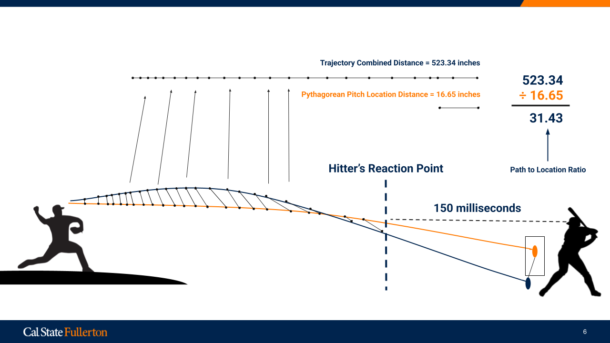
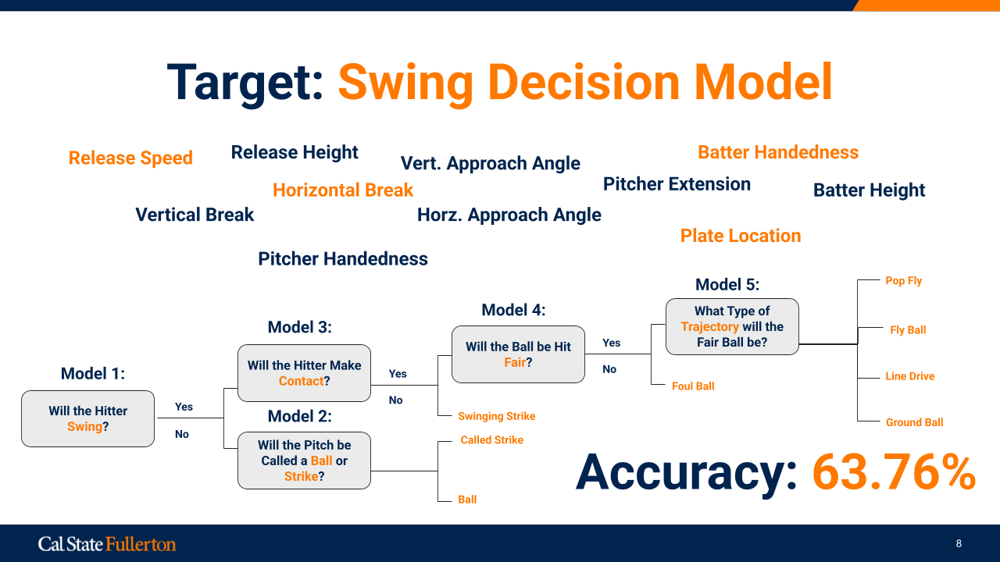
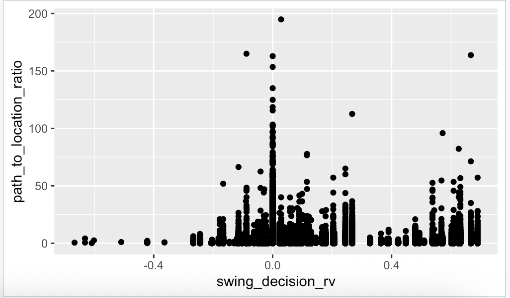
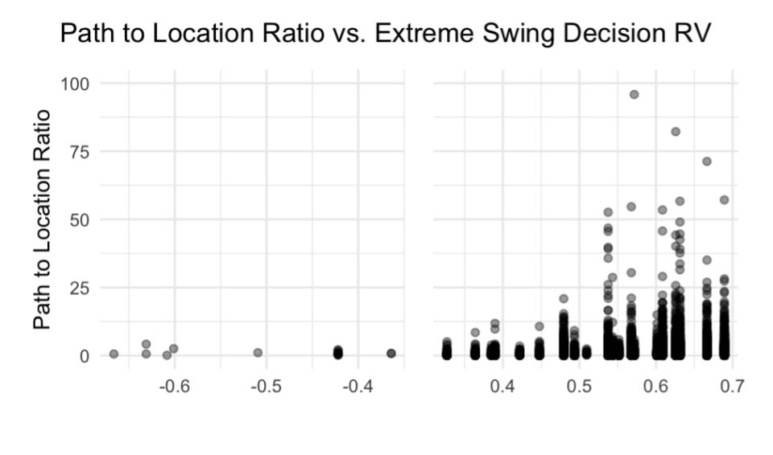

# CCAM Tunneling Project

Current project aimed at understanding tunneling as a phenomenon based on a hitter's observation of pitches along their path.

Tunneling metric is quantified by creating a lattice between subsequent pitch types, measuring points across 200 timestamps across the trajectory of each pitch type (measured using
9-pitch parameters from baseball savant data. The bounds for this are between pitch release and hitter reaction point (150 ms before pitch crosses home plate).

To test this metric, I created a "swing decision model" which attempts to isolate a hitter's swing decisions away from how effective a pitch is on its own.
The swing decision metric takes into account pitch speeds, movements, approach angles, release points, hitter and pitcher handedness, count, among a multitude of other factors.
These factors are used in multiple binary classification lightgbm models to predict the event that is most likely to occur from this pitch's individual characteristics. These events are mapped
to run values, and then compared to the actual outcome of the pitch. This model predicted the correct event ~64% of the time. After, real outcome and predicted outcome are compared, the
difference between the two is meant to represent the discrepancy between a hitter's swing decisions and the effectiveness of the individual pitch, hoping to quantify the effects of factors
outside of how effective the individual pitch was.

After this process, I had noticed that the 2.5 million pitch dataset (all pitches 2022-2024 on statcast), and needed to narrow down to pitches with the intention of tunneling. Additionally, in an attempt to account for the difference in the hitters ability to perceive pitches in the x, y, and z directions, I created a model which found the optimal x, y, and z weights for maximizing the r^2 value between my swing decision metric and my tunneling metric. It was revealed that the weights were about x = 1.2, y = 0.4, and z = 1.4. All of this code can be found in tunneling_model.R.

Finally, with the new weights, the p-val between the swing decision metric and the tunneling metric was 2.2 x 10-16. The metrics output the following scatterplot:

Notably, there seems to be a trend along the edges where extremely good tunneling leads to unexpectedly bad hitter outcomes , and extremely bad tunneling leads to unexpectedly good hitter outcomes. After taking out ±2 standard deviations, we are left with this plot, showing a trend.

Given this, I created a chase_above_expected model, using the same methodology as the swing decision model, though used to find the hitters expected probability of chasing at a pitch. When compared to the weighted tunneling metric, in contexts where tunneling is likely intentional, the correlation between the two is relatively very strong.

.16 R^2 value between tunneling metric and expected chase metric on breaking pitches following a fastball in putaway counts.

.12 R^2 value between tunneling metric and expected chase metric on offspeed pitches following a fastball in putaway counts.

Next steps:
I am currently working on a cv model in python which will be able to put a reliable value on where a hitter's head is in 3d space based on MLB broadcasts. Using this point, I will be able to compare the different angles the hitter percieves along the pitches path, intuitively allowing the model to perceive pitches from the same perspective as a hitter would. Using this, I want to compare the new findings to the trajctory findings in the above study.
