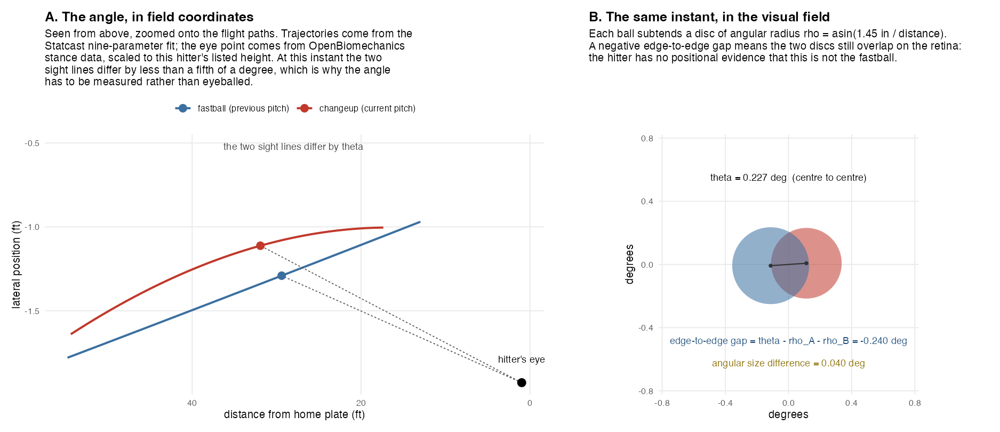
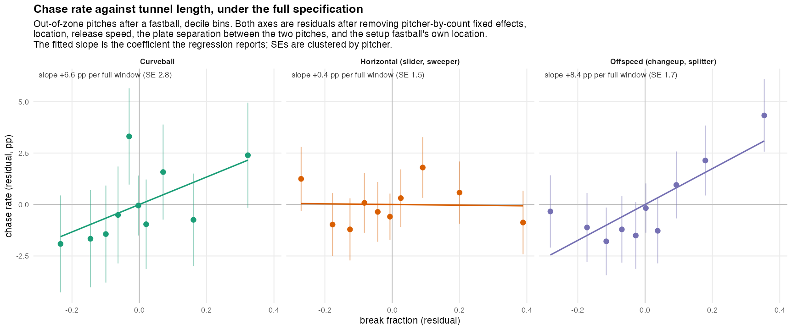

# CCAM Tunneling Project

Current project aimed at understanding tunneling as a phenomenon based on a hitter's observation of pitches along their path.

Tunneling metric is quantified by creating a lattice between subsequent pitch types, measuring points across 200 timestamps across the trajectory of each pitch type (measured using
9-pitch parameters from baseball savant data. The bounds for this are between pitch release and hitter reaction point (150 ms before pitch crosses home plate).

To test this metric, I created a "swing decision model" which attempts to isolate a hitter's swing decisions away from how effective a pitch is on its own.
The swing decision metric takes into account pitch speeds, movements, approach angles, release points, hitter and pitcher handedness, count, among a multitude of other factors.
These factors are used in multiple binary classification lightgbm models to predict the event that is most likely to occur from this pitch's individual characteristics. These events are mapped
to run values, and then compared to the actual outcome of the pitch. This model predicted the correct event ~64% of the time. After, real outcome and predicted outcome are compared, the
difference between the two is meant to represent the discrepancy between a hitter's swing decisions and the effectiveness of the individual pitch, hoping to quantify the effects of factors
outside of how effective the individual pitch was.

After this process, I had noticed that the 2.5 million pitch dataset (all pitches 2022-2024 on statcast), and needed to narrow down to pitches with the intention of tunneling. Additionally, in an attempt to account for the difference in the hitters ability to perceive pitches in the x, y, and z directions, I created a model which found the optimal x, y, and z weights for maximizing the r^2 value between my swing decision metric and my tunneling metric. It was revealed that the weights were about x = 1.2, y = 0.4, and z = 1.4. All of this code can be found in tunneling_model.R.

Finally, with the new weights, the p-val between the swing decision metric and the tunneling metric was 2.2 x 10-16. The metrics output the following scatterplot:

Notably, there seems to be a trend along the edges where extremely good tunneling leads to unexpectedly bad hitter outcomes , and extremely bad tunneling leads to unexpectedly good hitter outcomes. After taking out ±2 standard deviations, we are left with this plot, showing a trend.

Given this, I created a chase_above_expected model, using the same methodology as the swing decision model, though used to find the hitters expected probability of chasing at a pitch. When compared to the weighted tunneling metric, in contexts where tunneling is likely intentional, the correlation between the two is relatively very strong.

.16 R^2 value between tunneling metric and expected chase metric on breaking pitches following a fastball in putaway counts.

.12 R^2 value between tunneling metric and expected chase metric on offspeed pitches following a fastball in putaway counts.

Next steps:
I am currently working on a cv model in python which will be able to put a reliable value on where a hitter's head is in 3d space based on MLB broadcasts. Using this point, I will be able to compare the different angles the hitter percieves along the pitches path, intuitively allowing the model to perceive pitches from the same perspective as a hitter would. Using this, I want to compare the new findings to the trajctory findings in the above study.

---

## Update, September 2026: measuring the tunnel from the hitter's eye

Everything above is left as written. This section records how the "next step"
described there was carried out, and what it changed. Code for this branch
lives in the parent repo under `baseball/` (see below), not in this folder.

### What the original metric assumed

The lattice metric above integrates the 3D distance between two trajectories in
**field coordinates**, then weights the axes x = 1.2, y = 0.4, z = 1.4. Those
weights were fit to maximise agreement with the swing-decision metric, and they
were doing a job they were never designed for: standing in for how salient
each direction of separation is *to the hitter*. A foot of lateral separation
at 50 ft from the plate and a foot at 10 ft are the same number in field
coordinates. They are not the same thing on the hitter's retina.

### What changed

The weights are replaced by the quantity they were approximating: **the angle
the two pitches subtend at the hitter's eye.**

1. **A real eye point.** Left- and right-handed hitter eye positions were
   recovered from the OpenBiomechanics hitting motion-capture trials
   (`baseball/obm_eye_point.py`), registered into Statcast's frame (feet,
   origin at the back tip of home plate), then adjusted per MLB batter for
   listed height (`baseball/obm_hitter_eye_points.py`). Eye height tracks
   stature at r = +0.76 and is modelled as a ratio of height; lateral and depth
   offsets showed no height relationship and are left at the lab average.

   | Side | Eye x (ft, MLB-adjusted) | Eye y (ft, toward mound) | Eye z (ft) |
   |---|---|---|---|
   | RHH | −2.13 | 0.97 | 5.36 |
   | LHH | +2.15 | 0.65 | 5.30 |

2. **The ball is a disc, not a point.** A baseball is 2.9 in across and
   subtends about 0.6° at the commit point, which is not negligible against
   the separations in question. Each pitch is an angular disc with radius
   ρ(t) = asin(r_ball / d_eye(t)); the pair's **edge-to-edge gap** is
   θ(t) − ρ_A(t) − ρ_B(t). A gap ≤ 0 means the discs overlap on the retina and
   the hitter cannot separate them at all. Angular diameter also carries a
   depth cue, so two pitches at the same instant but different depths look
   different sizes even with coincident centres.

3. **Break fraction.** With an acuity threshold τ = 0.05°, the metric is the
   share of the decision window (release → 150 ms before the plate) that
   elapses before the pair first becomes separable. 0 = distinguishable out of
   the hand; 1 = still fused at the commit point.

### What it adds

Tested at the pitch level on ~96k primary-fastball → secondary pairs, 2026,
with pitcher fixed effects and pitcher-clustered standard errors
(`baseball/angular_tunnel_validation.R`):

| Outcome | Angular (eye-level) metric | Original weighted-distance metric |
|---|---|---|
| **Chase rate**, all pairs (n = 60,209; 756 arms) | **+1.6 pp per SD, t = 8.2, p < 10⁻¹⁵** | +1.5 pp per SD, t = 3.5, p = .0004 |
| Chase, changeups | +2.0 pp / SD, p = 3×10⁻⁷ | null |
| Chase, splitters | +2.9 pp / SD, p = 6×10⁻⁵ | null |
| Chase, curveballs | +1.9 pp / SD, p = 4×10⁻⁴ | null |
| Chase, sliders / sweepers | null | null |
| Swing-decision RV (the metric above) | null | +0.005 / SD, p = 4×10⁻⁷ |
| Miss distance | null | null |
| Grading model, slider whiff AUC (shape + location → + tunnel) | .799 → .800 | .799 → .797 |

Three readings:

- **The eye-level metric is a sharper chase predictor.** Same effect size per
  SD as the old metric on the pooled sample, less than half the standard error,
  and it resolves the effect *within* offspeed and curveball pairs where the
  field-coordinate version could not. The chase result survives controlling for
  plate separation between the two pitches and for the previous pitch's own
  location (`angular_tunnel_chase_robust.R`, `angular_tunnel_two_strike.R`).
- **It does not improve the swing-decision run value or a stuff-style grading
  model.** Once location is in the model, neither tunnel metric adds anything
  to whiff prediction. The original metric's correlation with swing-decision RV
  in the scatterplots above therefore deserves a caution: some of it is the
  two pitches finishing near each other, which the eye-level metric, being
  computed on angle rather than plate distance, does not reward.
- **So the right home for tunneling is the decision, not the grade.** It
  predicts whether the hitter commits to a ball out of the zone. It does not
  predict what happens after he commits.

Figures `angtun_fig0` … `angtun_fig5` and the RDS outputs (`angular_tunnel_2026.rds`,
`angular_tunnel_validation.rds`, `angular_tunnel_grading.rds`) are under
`data/statcast_model/`. Restating one SD of eye-level tunnel in mph and inches
of separation is in `angular_tunnel_tangible.R`.

### Caveat

The eye point is a lab-average stance, height-adjusted, not per-pitch head
tracking. The broadcast computer-vision head localisation described in "Next
steps" above is still the way to turn this into a per-swing measurement; the
rubber-position pipeline in `baseball/rubber_*` is the first half of that
tooling.

### Prior work this builds on

The idea that tunneling has to be measured from the hitter's vantage point,
not the centre-field camera's, comes from perception research; this branch is
an implementation of it with a measured eye position and a disc model of the
ball.

- Gray, R. (2017). *Pitch Tunneling & Perceptually Equivalent Pitches.* The
  Perception & Action Podcast, Jun 24, 2017. Two pitches with the same visual
  direction from the batter's eye are perceptually one pitch until they
  diverge; superimpose them from the batter's viewpoint and you see a single
  ball. Overlays from the broadcast camera do not show what the hitter sees.
  <https://perceptionaction.com/pitchtunnels/>
