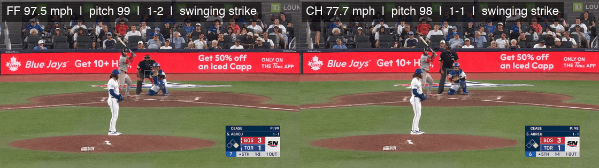
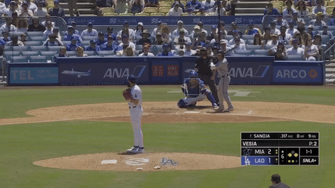
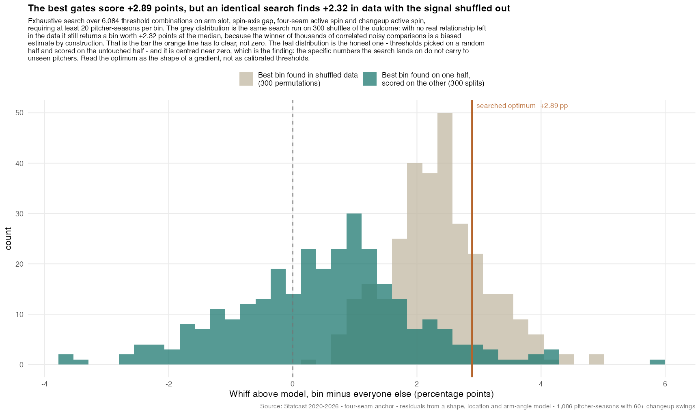

# The Parachute Changeup

**A changeup that spins like the fastball is the most underrated pitch in
baseball, and the tools the industry uses to grade pitches are built in a way
that guarantees they will keep underrating it.**

This repo is the research program behind that claim: Statcast 2020–2026, D1
TrackMan 2023–2025, a stack of out-of-fold whiff models, an unsupervised search
over the deception profile, a mechanism battery, and the broadcast video. The
argument is below. The code, data policy, and script catalog are in
[`docs/REPO_GUIDE.md`](docs/REPO_GUIDE.md); the full technical handoff is
[`HANDOFF.md`](HANDOFF.md).

> **Where the confirmatory number stands.** Under the pre-registered spec, the
> matched-axis bin beats a location-aware stuff model by **+1.78 ± 0.97 whiff
> points (arm-clustered, p = 0.067)** across MLB and D1. MLB alone is
> **+3.07 ± 1.38, p = 0.038**. The decision rule for the next data
> (D1 2022 and 2026) is already frozen in
> [`parachute_precommit.md`](data/statcast_model/article_assets/parachute_precommit.md).
> We think it confirms. This document is the argument for why, written down
> before the number arrives.

---

## 1. The claim

Two changeups can have the same velocity, the same movement, the same release
point, and grade identically on Stuff+, tjStuff+, PitchingBot, or any in-house
LightGBM clone. One of them spins on the same axis as the pitcher's
four-seamer. The other spins twenty-five degrees away. **The first one will
miss more bats than the model says, and the second one will not.**

The reason is not in the changeup. It is in the fastball. A hitter's swing
decision is made on a prediction of *which* pitch is coming, and that
prediction is built from the cues available in the first fifteen feet: release
point, arm slot, arm speed, and the spin picture on the ball. A changeup that
matches the four-seamer on all four says "fastball" for the whole decision
window. The only cue that says otherwise is velocity, and velocity is exactly
the cue a hitter cannot resolve until the swing is committed. So the hitter
swings on fastball timing at a ball that arrives ten, fifteen, twenty mph late
and has already dropped under the barrel.

Stuff models grade the **object**. Deception is a property of the **pair**.
That is the whole thesis, and every section below is one way of checking it.

---

## 2. Watch it

Dylan Cease, 2026-08-11 at Toronto, fifth inning, same at-bat against Wilyer
Abreu. Left is pitch 99, a four-seamer at 97.5 mph. Right is pitch 98, the
changeup one pitch earlier at 77.7 mph. **Both swinging strikes.** The clips
are release-synchronized to within 0.05 s.



What Statcast measured on those two pitches:

| | Four-seam (pitch 99) | Changeup (pitch 98) | Gap |
|---|---|---|---|
| Velocity | 97.5 | 77.7 | **19.8 mph** |
| Spin axis | 195° | 191° | **4°** |
| Release point (x, z) | −1.78, 6.20 ft | −1.56, 6.23 ft | 0.2 ft |
| Spin rate | 2485 | 1645 | 840 rpm |
| Result | swinging strike | swinging strike | |

A four-degree axis gap and a release point inside a quarter of a foot, and
twenty miles an hour between them. Freeze the frame at foot strike: nothing
distinguishes the two deliveries. Abreu's front foot lands on fastball timing
both times. On the right, the ball is not where the bat goes.

For contrast, Alex Vesia's turnover changeup, roughly 32° off his fastball's
axis. A good pitch, and you can watch it become a changeup:



More video, straight from Savant (each link is that pitcher's changeup
swinging strikes for the season, with a clip on every row):

| Pitcher | Season | Axis gap | Slot | Velo sep | Whiff | Model | Above | |
|---|---|---|---|---|---|---|---|---|
| **Dylan Cease** | 2026 | 4.8° | 59.7° | 15.0 | 53.6% | 42.5% | **+11.0** | [clips](https://baseballsavant.mlb.com/statcast_search?hfPT=CH%7C&hfGT=R%7C&hfPR=swinging%5C.%5C.strike%7C&hfSea=2026%7C&player_type=pitcher&pitchers_lookup%5B%5D=656302&group_by=name&min_pitches=0&min_results=0&min_pas=0&sort_col=pitches&player_event_sort=api_p_release_speed&sort_order=desc#results) |
| **Tarik Skubal** | 2021 | 3.7° | 60.0° | 12.0 | 49.1% | 38.8% | **+10.3** | [clips](https://baseballsavant.mlb.com/statcast_search?hfPT=CH%7C&hfGT=R%7C&hfPR=swinging%5C.%5C.strike%7C&hfSea=2021%7C&player_type=pitcher&pitchers_lookup%5B%5D=669373&group_by=name&min_pitches=0&min_results=0&min_pas=0&sort_col=pitches&player_event_sort=api_p_release_speed&sort_order=desc#results) |
| **Andrew Abbott** | 2023 | 9.8° | 45.0° | 6.2 | 39.4% | 28.7% | **+10.7** | [clips](https://baseballsavant.mlb.com/statcast_search?hfPT=CH%7C&hfGT=R%7C&hfPR=swinging%5C.%5C.strike%7C&hfSea=2023%7C&player_type=pitcher&pitchers_lookup%5B%5D=671096&group_by=name&min_pitches=0&min_results=0&min_pas=0&sort_col=pitches&player_event_sort=api_p_release_speed&sort_order=desc#results) |
| **Robbie Ray** | 2025 | 6.1° | 43.6° | 8.6 | 39.2% | 33.1% | **+6.1** | [clips](https://baseballsavant.mlb.com/statcast_search?hfPT=CH%7C&hfGT=R%7C&hfPR=swinging%5C.%5C.strike%7C&hfSea=2025%7C&player_type=pitcher&pitchers_lookup%5B%5D=592662&group_by=name&min_pitches=0&min_results=0&min_pas=0&sort_col=pitches&player_event_sort=api_p_release_speed&sort_order=desc#results) |
| **Osvaldo Bido** | 2025 | 7.1° | 35.2° | 5.7 | 25.0% | 18.5% | **+6.5** | [clips](https://baseballsavant.mlb.com/statcast_search?hfPT=CH%7C&hfGT=R%7C&hfPR=swinging%5C.%5C.strike%7C&hfSea=2025%7C&player_type=pitcher&pitchers_lookup%5B%5D=674370&group_by=name&min_pitches=0&min_results=0&min_pas=0&sort_col=pitches&player_event_sort=api_p_release_speed&sort_order=desc#results) |
| Alex Vesia (turnover foil) | 2026 | ~32° | | | | | | [clips](https://baseballsavant.mlb.com/statcast_search?hfPT=CH%7C&hfGT=R%7C&hfPR=swinging%5C.%5C.strike%7C&hfSea=2026%7C&player_type=pitcher&pitchers_lookup%5B%5D=681911&group_by=name&min_pitches=0&min_results=0&min_pas=0&sort_col=pitches&player_event_sort=api_p_release_speed&sort_order=desc#results) |
| Jeremy Hellickson (old school) | 2016 | pre-Hawk-Eye | | | | | | [clips](https://baseballsavant.mlb.com/statcast_search?hfPT=CH%7C&hfGT=R%7C&hfPR=swinging%5C.%5C.strike%7C&hfSea=2016%7C&player_type=pitcher&pitchers_lookup%5B%5D=476451&group_by=name&min_pitches=0&min_results=0&min_pas=0&sort_col=pitches&player_event_sort=api_p_release_speed&sort_order=desc#results) |

"Above" is the out-of-fold whiff residual over tjStuff+ v3.0 features plus arm
angle plus location (`r4`). Build your own with
`baseball/parachute_clips.py` (see the repo guide).

---

## 3. Let the data pick the profile

The most convincing thing we did was stop describing the pitch and ask the
data to describe it for us.

We took every four-seam-primary pitcher-season 2020–2026 with at least 60
changeup swings, scored each one on how much its changeup out-whiffed a stuff
model that **never sees the fastball relationship** (tjStuff+ shape features,
arm angle, and location, out of fold), and then ran an unsupervised grid search
over four gates that describe the fastball–changeup pair:

| Gate | Grid | What it encodes |
|---|---|---|
| Arm slot | 25° → 55° by 2.5° | Where the ball comes from |
| Spin-axis gap vs four-seam | 6° → 30° by 2° | How much the spin picture gives away |
| Four-seam active spin | .85 → .96 by .02 | How "clean" the fastball's spin is |
| Changeup active spin | .85 → .96 by .02 | How "clean" the changeup's spin is |

6,084 combinations, minimum bin of 20 seasons, objective = mean residual in
the bin minus mean residual for everyone else. No hand-picking. No named
pitchers. `baseball/optimal_gates.R`.



### What the optimizer chose

```
arm slot          >= 35°
axis gap          <= 8°
FF active spin    >= 0.85     (grid floor)
CH active spin    >= 0.89
```

Twenty pitcher-seasons, **+2.89 whiff points above model**, 95% CI
[+0.85, +4.92], nominal p = 0.008. And the top of the roster it produced,
with no names supplied:

| Pitcher | Season | Arm | Axis gap | Velo sep | Whiff | Expected | Above |
|---|---|---|---|---|---|---|---|
| **Dylan Cease** | 2026 | 59.7° | 4.8° | 15.0 | 53.6% | 42.5% | **+11.0** |
| **Tarik Skubal** | 2021 | 60.0° | 3.7° | 12.0 | 49.1% | 38.8% | **+10.3** |
| Osvaldo Bido | 2025 | 35.2° | 7.1° | 5.7 | 25.0% | 18.5% | +6.5 |
| Robbie Ray | 2025 | 43.6° | 6.1° | 8.6 | 39.2% | 33.1% | +6.1 |
| Angel Zerpa | 2023 | 41.6° | 7.2° | 7.8 | 31.3% | 25.3% | +5.9 |
| Dennis Santana | 2021 | 35.1° | 3.4° | 8.5 | 40.2% | 34.6% | +5.7 |
| Mike Foltynewicz | 2021 | 41.1° | 6.6° | 8.6 | 33.3% | 27.7% | +5.6 |

Fifteen of the twenty seasons are positive; the median is about +3. The two
pitchers the whole program had been circling by eye, the search found on its
own, and put first and second.

### What the search tells you that a single bin cannot

Three things came out of watching the optimizer work that we consider
stronger evidence than the winning cell itself.

**It threw away the spin-efficiency gates.** Both active-spin thresholds
collapsed to the bottom of their grids. The optimizer was allowed to demand
clean spin on either pitch and declined. Whatever the deception is, it is not
"high active spin." It is the *relationship*.

**It only ever reached for axis and slot.** Across the 300 split-half
re-searches, the winning arm threshold wandered from 25° to 52.5° and the axis
threshold from 8° to 22°, but the *direction* never flipped: tighter axis
match and higher slot always scored higher. The location of the cliff is
fuzzy. The slope of the hill is not.

**The a-priori ladder points the same way.** Without any searching, using
round cuts chosen before looking:

| Gate | Seasons | Above model | p |
|---|---|---|---|
| All four gates merely above league average | 155 | −0.12 | .82 |
| Spin floors (.85/.85) + axis ≤ 10° | 35 | +1.08 | .24 |
| Spin floors + axis ≤ 10° **+ arm ≥ 44°** | 8 | **+4.46** | .046 |
| Searched optimum (above) | 20 | +2.89 | .008 |

Add the axis gate, the residual appears. Add the slot gate, it triples. That
is the hypothesis behaving the way a real effect behaves under a sharpening
definition, and the opposite of how a noise artifact behaves.

**The honest limit, in two lines.** The searched optimum does not, by itself,
beat a permutation null: shuffle the outcome and re-run the whole search 300
times and the median "winner" is +2.32 (p ≈ .22 against the search). On split
halves the winning cell shrinks 86%. That is why the confirmatory spec in
`spec_lock.R` uses round a-priori cuts and clustered errors rather than the
searched thresholds, and why we call the search *convincing* rather than
*conclusive*. It tells you where to look. The pre-committed test tells you
whether what you found is there.

---

## 4. Matched spin alone is nothing; matched spin plus a kill is the pitch

The first result of the program, from July 31, 2026, and the one every later
cut confirmed: a changeup that matches the fastball's axis but only takes six
or seven mph off it **underperforms** its model. The same axis match with a
twelve-to-fifteen mph kill overperforms by double digits.

Kikuchi versus Cease is the whole story in two rows. Yusei Kikuchi is the most
frequent member of the locked bin (three seasons) at about 9 mph of
separation, and he sits at +0.1. Cease at 15 mph sits at +11.0. The fastball
look buys the swing. The kill is what makes the swing miss.

This is also why the gate search reached for slot. A high slot is what lets a
pitcher throw a slow, backspinning ball that still *drops*: gravity does the
work the changeup's spin is not doing, so the pitch parachutes under the
barrel instead of floating into it.

---

## 5. The archetype the industry likes least is the one that beats its model most

Stuff models have preferences. They like a "power changeup": hard, big axis
separation from the fastball, real horizontal movement of its own. They
dislike the parachute. Here is every changeup archetype on a strict temporal
holdout, model trained 2020–2023 and asked about 2024–2026, four-seam-primary
arms, 75-swing floor:

| Archetype | Seasons | Predicted whiff | Actual | Miss |
|---|---|---|---|---|
| Extreme seam shift | 10 | 30.1% | 43.1% | **+13.0** |
| **Tight axis match** | 17 | 30.3% | 41.3% | **+11.0** |
| Seam-shifted match | 44 | 29.2% | 37.3% | +8.1 |
| Axis + separation | 56 | 29.9% | 36.2% | +6.3 |
| Traditional, low seam dev | 26 | 30.8% | 34.1% | +3.3 |
| Power changeup | 66 | 30.1% | 29.2% | **−0.9** |

Sort the league by how much a pitch designer would want to "fix" the
changeup, and you have sorted it by how badly the model underestimates it. The
power changeup, the shape design produces on purpose, is the only archetype
that underperforms, and it does so significantly (−1.96, p = .0075).

**It repeats.** Year-over-year correlation of the whiff residual is r = .577
(n = 40, p = .0001) for the axis-plus-separation group and r = .453 (n = 31,
p = .01) for the seam-shifted group. Arms who beat their model do it again the
next season. Noise does not do that.

**Handing the model the missing features does not fix it.** We added the
axis gap, seam deviation, arm slot, arm-angle gap, season-level arsenal
summaries, interaction terms, and finally an explicit archetype flag frozen on
the training years:

| Archetype | Gap, stuff only | Gap, everything added | Closed |
|---|---|---|---|
| Traditional | 3.76 | 0.73 | 81% |
| Axis + separation | 6.98 | 3.51 | 50% |
| Tight axis match | 10.73 | 6.38 | 41% |
| Seam-shifted match | 9.93 | 6.81 | 31% |
| Extreme seam shift | 16.28 | 12.41 | 24% |

The stronger the effect, the less any feature set can absorb. That is not a
missing column. It is a missing frame. A model that scores one pitch cannot
represent an effect that lives between two, no matter what you feed it.

A related trap, found the hard way: putting `axis_diff` into a gated
all-types model made things *worse*. The model learned "bigger spin difference
→ more miss" (splitters, kick-changes) and buried Cease and Vesia together.
The right proof is a residual over a model that never sees the axis gap, then
asking whether matched-axis pitches sit above zero. They do.

---

## 6. Old-school coaches had this right

Before Hawk-Eye imaged a spin axis, the changeup was taught as a *disguise*,
not a *shape*. "Fastball arm speed, fastball slot, fastball spin, take ten
off" is in every manual from the 1970s through the 2000s. Nobody said "give
it a different clock face."

Jeremy Hellickson's changeup was mocked on movement plots as a fastball with
the engine off and carried him to a Rookie of the Year season; scouts called
it "invisible." Glavine and Maddux were described for two decades as pitchers
whose every pitch looked like the fastball for half its flight. Pedro,
Santana, Hoffman: the reputation was tunnel and sell, not horizontal run.

When movement plots and stuff models arrived, that knowledge was reclassified
as folklore because it could not be measured and the shape metrics said the
pitch was bad. The resulting orthodoxy, kill efficiency, pronate, buy arm-side
run, produced the power changeup in the table above. The disguise pitch it
replaced is the one that beats the model.

---

## 7. Where the naive version breaks, and what fixes it

Advocacy that hides the hole is not advocacy. The purest tight-axis changeup
misses bats and **still loses runs**: its whiff channel is worth +0.37 runs
per 100 and its ball-in-play channel gives back −0.90. A backspinning ball
thrown slowly from a high slot is a fly ball when it is squared.

The refinement, generated after the lock and therefore exploratory
(`velo_sep_45`, `velo_sep_46`): hold the axis match and the velocity kill
constant, and split by whether the changeup has **seam-shifted wake**,
movement the spin does not predict and the hitter cannot see.

| Cell | Seasons | Whiff residual | Run value / 100 |
|---|---|---|---|
| Axis match **+ seam shift** | 44 | **+4.00** (p < .0001) | **+0.38** |
| Axis match, no seam shift | 26 | +0.88 (p = .44) | +0.12 |
| Extreme seam shift | 10 | **+7.80** (p < .0001) | **+0.82** |

The matched axis buys the swing. The seam shift buys the miss and protects
the contact. The arms who have both (Skubal 2021–22, Cease 2021 and 2026,
Ragans 2024–25, Springs, Luzardo, Boyd, Rodón 2024, Ray 2025) are not marginal
pitchers who found a trick. Several are among the best in baseball, and the
pitch a model would have told them to fix is part of why.

---

## 8. The ledger

Everything that cuts against the argument, in the same document, because the
pre-commit requires it and because the argument is stronger for surviving it.

| Test | Result | Reading |
|---|---|---|
| Locked bin, MLB 2020–2026 | +3.07 ± 1.38, p = .038 | Positive |
| Locked bin, D1 2023–2025 | +1.15 ± 1.95, p = .56 | Same direction, underpowered |
| Pooled, one row per arm (decides) | **+1.78 ± 0.97, p = .067** | Suggestive, not established |
| Era holdout | 2020–23 +4.83 (p = .003); 2024–26 −0.31 (p = .92) | The bin threshold may be fit to early seasons |
| Run value, locked bin | −0.41 / 100 vs pool | The naive version gets hit in the air (§7) |
| Overperform more after a four-seamer? | +2.34 ± 2.62, p = .37 | Null, underpowered |
| Tunneling concentrates in the bin? | +0.01 ± 1.14, p = .99 | Null |
| Spin-*rate* matching (negative control) | −3.85 ± 0.73, p < .001 | Control holds: it is axis, not rate |
| Gate-search permutation | p ≈ .22 | Search alone does not beat noise |

Two things said plainly. The mechanism tests that would demonstrate "the
hitter mistook it for a fastball" at the pitch level came back null, so the
perceptual story in §1 is the best explanation of the pattern, not a
demonstrated one. And the raw whiff edge of the locked bin is only +0.7
points: a +3 residual means "more miss than this stuff should produce," not
"an elite whiff pitch."

---

## 9. What settles it

Written before the data was seen. Add D1 TrackMan 2022 and 2026 under the
frozen spec in `baseball/spec_lock.R`, no retuning:

- **Confirm** if pooled p < 0.05 **and** the point estimate stays above +1.2.
- **Kill** if the point estimate falls below +0.8.
- **Unresolved** otherwise; wait for MLB 2027.

If it confirms, the industry has been grading a real pitch as a defect for a
decade. If it kills, the old-school idea was a good story that did not survive
Hawk-Eye, and this README gets rewritten to say so.

---

## Using the repo

```bash
Rscript install.R                                          # R packages
python3 -m venv .venv-cv && .venv-cv/bin/pip install -r baseball/requirements-cv.txt

Rscript baseball/spec_lock.R                               # the confirmatory number
Rscript baseball/bin_roster_detail.R searched              # §3 roster (Cease / Skubal on top)
Rscript baseball/optimal_gates.R                           # §3 search (slow: 300 permutations × 6,084 cells)
.venv-cv/bin/python baseball/parachute_clips.py --pitcher 656302 --season 2026 --n 3 --pair
```

Raw Statcast, `.rds` caches, and video frames are not in git. Layout,
reproduction order, data policy, the 293-script catalog, and the rules that
cannot be relaxed are in [`docs/REPO_GUIDE.md`](docs/REPO_GUIDE.md) and
[`CLAUDE.md`](CLAUDE.md). Status documents:
[decision memo](data/statcast_model/article_assets/parachute_decision_memo.md) ·
[pre-commit](data/statcast_model/article_assets/parachute_precommit.md) ·
[prevalence and run value](data/statcast_model/article_assets/parachute_useful.md) ·
[article draft](data/statcast_model/article_assets/parachute_article.md) ·
[figure captions](data/statcast_model/article_assets/figure_captions.md).
