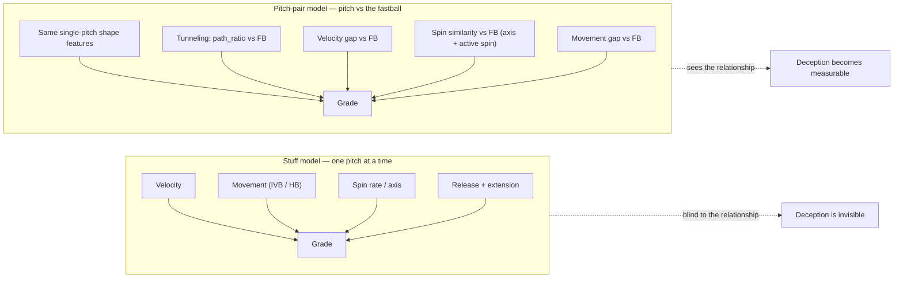

# Figure captions — Pitch-Pair Deception Beyond Stuff Models

Article-ready captions for each visual. Files live in
`data/statcast_model/article_assets/`. Numbers are pulled directly from the
extract CSVs written alongside the figures.

---

## Figure 1 — Concept: stuff model vs pitch-pair model

A stuff model grades every pitch from its own physical shape and never sees how
it relates to the pitcher's fastball. A pitch-pair model adds fastball-relative
features — tunneling and spin similarity — so deception (a *relationship*
between two pitches) becomes visible.

*Caption:* Traditional stuff grades (Stuff+, TJStuff+) score a pitch in
isolation. Deception is a relationship, so I added fastball-relative features
that let the model see how a secondary pitch travels with, and breaks off of,
the pitcher's fastball.

---

## Figure 2 — Tunneling schematic (`fig2_tunnel_schematic.png`)

*Caption:* Tunneling means two pitches share a flight path early and separate
late. `path_to_location_ratio` = the integrated early-flight distance between
the pitches divided by their separation at the plate. A **low** ratio means the
pitches stayed together deep into flight before splitting — a tight tunnel.

---

## Figure 3b — Location vs deception, by breaking type (`fig3_miss_drivers_by_type.png`)

*Source:* `ext_miss_drivers_by_type.csv` (2-strike breaking balls thrown right
after the pitcher's primary fastball, 49,130 competitive swings, 2023H2–2026).

*Caption:* Every driver scored in one currency — held-out 2026 RMSE improvement
over an intercept, trained on 2023H2–2025 — split by SL / CU+KC / ST. **Where
the breaking ball finishes is the whole ballgame for a single pitch** (29–32%),
while the trajectory tunnel adds 2.2–2.9% and the fastball-relative shape and
spin gaps add ~0. Two null results are load-bearing: the **setup fastball's
location is worth essentially nothing** (≤0.1%), and the **FB→BB separation
vector** (5.6–7.2%) is mostly a restatement of "the breaking ball finished
low" — it adds only +0.2pp on top of absolute location, and its components
correlate 0.57–0.62 with the finish.

> Level-of-analysis note: shape and spin gaps are near-constant within a given
> pitcher's own pitch type, so they cannot explain *pitch-to-pitch* variation by
> construction. Their ~0 here is not in tension with Figs 5–11, which measure
> how those same cues separate *pitchers* from one another.

*Supporting analysis (in `data/statcast_model/tunnel_location/`):*
- `fig_offset_surface.png` — **the cleanest statement of why the setup fastball's
  location does not matter.** Top row: E[miss|swing] over the FB→BB separation vector,
  whose optimum is a large downward gap (SL +1.1/−2.7 ft, CU +0.6/−3.0, ST +1.7/−1.9).
  Bottom row: the same target charted over where the *fastball* was located, on the same
  colour scale, and it is featureless — E[miss] spans just **0.27 in (SL), 0.58 in (CU)
  and 0.41 in (ST)** across the whole plate, against **3.39–3.75 in** across breaking-ball
  locations, a 6–13× difference. Two markers make the point sharper: adding the optimal
  separation back to the fixed optimal breaking-ball spot implies a fastball at
  z = 3.0–3.6 ft (at or above the top of the zone), while the fastball surface's own best
  cell sits at z = 1.5 ft for SL and CU — the *bottom* of the zone. The two answers
  contradict each other, which is the tell that the separation optimum encodes "put the
  breaking ball low" and carries no fastball instruction at all.
- `fig_target_stability.png` — the optimal breaking-ball spot moves only 0.16–0.23 ft
  across the nine setup-fastball zones. **The target is fixed**: it does not matter
  where the fastball went.
- `fig_bb_distribution.png` — only **14–21%** of 2-strike breaking balls land in the
  high-miss zone, which sits well below where the pitch density is centred.
- `fig_tunnel_command_validation.png` — in-zone breaking balls average **3.3–3.5×**
  the miss of out-of-zone ones, but a pitcher's rate of hitting the zone, while a
  stable trait (reliability 0.59–0.75), does **not** predict future miss or whiff
  (partial r = −0.18 / −0.08 after controlling for past performance, vs +0.45 / +0.37
  for past performance itself). Location precision to a fixed spot is therefore not
  the thing that separates arms — which is what makes the deception cues matter.

---

## Figure 3c — Location sensitivity of the tunnel, by pitch type (`fig3c_tunnel_location_sensitivity.png`)

*Source:* `ext_tunnel_location_sensitivity.csv` (2-strike breaking balls after the
primary fastball, 2023H2–2026; 8.1k–13.8k pitches per tercile-by-type cell).

*Caption:* **High-Miss%** is the share of a pitcher's breaking balls that land in the
high-miss zone — the top 20% of the chase-adjusted miss surface. It is *not* a strike
rate; that zone sits mostly below the strike zone. Folding it into the tunnel picture answers a
question the earlier figures could not: **how much a tunnel depends on location is
itself a property of the pitch type.** Within each pitch type, breaking balls are
split into terciles of early-flight separation and then by whether they landed in
the high-miss zone; the red/navy gap is what the location was worth.

- **Curveball — the tunnel and the spot are complements.** The location gap widens
  monotonically as the tunnel tightens (4.77 → 5.96 → 6.43 in), a **1.35×** premium
  for tight over loose. The chase-adjusted per-pitch version agrees (0.72 → 0.98 →
  1.34 in). A tunneled curveball lives or dies on its spot.
- **Slider — the tunnel substitutes for the spot.** The relationship reverses
  (4.13 → 3.65 → 3.01 in, **0.73×**), again confirmed per pitch. A tight-tunneling
  slider keeps missing bats when it is mislocated; a loose one needs the zone.
- **Sweeper — flat** (4.36 → 5.19 → 4.53 in, **1.04×**). No interaction.

> Methods note — why the terciles use **early-flight separation** and not
> `path_ratio`: the ratio's denominator *is* the plate separation, and the high-miss
> zone sits far from the fastball, so hitting it mechanically shrinks the ratio
> (`cor(path_ratio, plate_sep) = −0.54`; `cor(High-Miss%, plate_sep) = +0.45`).
> Splitting on `path_ratio` sorts pitches by the very quantity the zone flag
> measures, and it showed the signature of that artifact: swing rates ranged
> 21–73% across cells, and the conditional and per-pitch metrics disagreed in
> direction for all three types. Re-splitting on the numerator alone balances swing
> rates (60–69% outside the zone, 21–32% inside) and brings the two metrics into
> agreement within every type — the results above.

---

## Figure 3c-2 — The high-miss zone split into its two axes (`fig3c2_zone_axis_split.png`)

*Source:* same pair dataset as Figure 3c, re-binned. The zone's **height band** and
**side band** are the 5th–95th percentile of the zone's own cells on each axis, so a
pitch can finish in one band, both, or neither.

*Caption:* Figure 3c's red bar, opened up. **Height is nearly the whole thing.**
Pooled across terciles, landing in the height band alone is worth **+5.9 in** of
E[miss | swing] for curveballs, +2.3 for sliders and +1.9 for sweepers, while the side
band alone is worth **+0.2 to +0.6 in** for every type. For the curveball, height alone
(+5.9) actually beats hitting both bands (+5.5) — the horizontal placement of a
curveball is irrelevant once it is at the right depth. The **sweeper is the one type
that genuinely needs both** (+4.3 together vs +1.9 for height alone), which is what you
would expect from the pitch whose whole shape is horizontal.

> Caveat: these are conditional on a swing, and a pitch in the height band but off to
> the side is a ball that gets taken — swing rates are 12–26% for height-only versus
> 23–37% for both bands. On the chase-adjusted per-pitch metric, both bands wins for
> every type (curveball 1.51 vs 0.87 in). The takeaway is not "ignore the side," it is
> that height is what converts a swing into a miss and side is what buys the swing.

Pitcher-level version of the same split appears in Figure 3d.

---

## Figure 3c-3 — What each axis does across the plate (`fig3c3_axis_jobs.png`)

*Source:* same pair dataset, 3-inch location bins, bins with <150 pitches dropped.

*Caption:* Marginal profiles of swing rate and miss distance against each plate axis.
**Swing rate traces the same hump on both axes** — a hitter swings at what is over the
plate and at what is belt-high, and falls off symmetrically in either direction. **Miss
distance is the asymmetric one:** it climbs steeply and monotonically as the pitch gets
lower (0 to 27 in for the curveball) but stays near zero across nearly the entire
horizontal range, lifting only at the far arm-side edge where few pitches go.

---

## Figure 3c-4 — Swing-vs-miss variance split by axis (`fig3c4_axis_decomposition.png`)

*Source:* `ext_zone_axis_decomposition.csv`. Each outcome is regressed on 3-inch
horizontal bins alone, vertical bins alone, and both; the explained variance is split
into what only one axis knows and what both share.

*Caption:* Tests the natural reading of Figure 3c-2 — that the side of the plate buys
the swing while height buys the miss. **The second half is emphatic, the first is only
relative.** The horizontal axis's share of the unique explained variance falls by half
or more moving from the swing decision to the miss in every pitch type: curveball
38% → 12%, slider 41% → 21%, sweeper 54% → 31%. So the side of the plate really does do
its work early, at the decision, and height really does do its work at contact.

But height is not merely the *miss* axis — for the curveball and slider it outweighs
side at **both** stages. The only case where horizontal placement is the primary driver
of the swing decision is the **sweeper** (54%), the pitch whose break is horizontal. And
even there the miss is still 69% vertical. A plausible mechanism: the barrel travels a
roughly planar arc, so lateral misplacement is partly absorbed by swinging earlier or
later, while vertical misplacement cannot be corrected once the swing plane is set.

> Note: `shared` is slightly negative for the chase outcome in the slider (−0.6) and
> sweeper (−1.2), meaning the two axes together explain a bit more than the sum of their
> parts. That is ordinary suppression, not an error — knowing the height changes what a
> given horizontal location implies.

---

## Figures 3c-5 to 3c-8 — The whiff and chase surfaces (`fig_whiff_zone.png`, `fig_swstr_zone.png`, `fig_chase_zone.png`, `fig_zone_overlay.png`)

*Source:* `ext_whiff_chase_peaks.csv`. Same pairs, same kernel, same top-20% zone rule
and same 2023H2–2025 training window as `fig_highmiss_zone.png`, refit on three other
targets: P(whiff | swing); **whiffs per pitch**, i.e. P(swing) × P(whiff | swing), the
swinging-strike rate; and P(swing | pitch outside the rulebook zone). The chase surface
is undefined inside the rulebook zone by construction, which is the hole in the middle
of that figure.

*Caption:* The spatial version of Figure 3c-4. **The chase zone and the conditional whiff
zone share 0% of their union in all six pitch-type-by-handedness panels.** The chase zone
hugs the bottom edge of the strike zone and reaches up into it; the whiff zone sits below
and to the glove side. Peak-to-peak they are **1.0–1.5 ft apart in height and 0.5–0.9 ft
across** — a diagonal separation, down and glove-side, vertical component about twice the
horizontal. Chase rate peaks at **74–83%** just under the zone; whiff rate given a swing
peaks at **52–69%** more than a foot lower.

**The tiebreaker is not a compromise.** Whiffs per pitch — the outcome that actually
counts — sides almost entirely with the whiff zone, overlapping it 35–61% while
overlapping the chase zone only 0–13%. Aiming at the maximum-chase spot yields **10–15%
swinging strikes per pitch**; aiming at the maximum-whiff spot yields **21–26%**, against
a true optimum of 23–28%. The extra miss rate down below the zone more than pays for the
swings given up by leaving the chase zone, so for a 2-strike breaking ball the
chase-maximising location costs roughly half the swinging strikes.

**Conditioning on a swing does not move the miss optimum.** `fig_misspp_zone.png` is
E[miss | swing] × P(swing), the chase-adjusted companion to `fig_highmiss_zone.png`. Its
peak is within 0.1–0.2 ft of the swing-conditional peak in all six panels, and within
0.1 ft of the conditional whiff peak. Values fall from 2.5–3.9 in per swing to 1.0–1.5
in per pitch, but the location does not move. So all four productive surfaces — whiff
given a swing, swinging strikes per pitch, miss per swing, miss per pitch — agree on the
same low glove-side spot, and only the chase surface disagrees, by 1.2–1.6 ft of height.

Note this concerns *where to put it*, not *whether it works* — the earlier validation
(`fig_tunnel_command_validation.png`) still found that hitting the zone in past seasons
does not predict a pitcher's future miss rate.

---

## Figure 3d — Tunnel drivers with location ability included (`fig3d_tunnel_drivers_with_location.png`)

*Source:* `ext_tunnel_drivers_with_location.csv` (pitcher × pitch-type, min 40 pairs).

*Caption:* Figure 3's driver correlations recomputed at the pitcher level, with
High-Miss% added as a driver and early-flight separation as the target so
every variable is on the same footing. High-Miss% is shown three ways: the full
two-dimensional zone, and each axis on its own — **height** (the pitch finished in
the zone's vertical band, at any horizontal position) and **side** (the zone's
horizontal band, at any height). The **velocity gap still dominates**
(r = +0.88 to +0.93). **Location ability lines up with tunneling only for the
curveball** (r = −0.24, p = 0.01), and it is a height effect (−0.21) more than a
side effect (−0.18). The split matters most for the slider, where the combined
number is a meaningless +0.03 because its two halves point in opposite directions:
side is −0.27 (p = 0.0001) while height is +0.14. Sweepers are near zero on every
version. Against the confounded `path_ratio` target, High-Miss% would read −0.19 to
−0.27 across all three types — most of which is the denominator effect described
above, not a real association.

---

## Figure 3 — What makes a breaking ball tunnel the fastball (`fig3_tunnel_drivers.png`)

*Source:* `ext_tunnel_drivers.csv` (breaking balls, 2-strike, n≈129k).

*Caption:* Correlation of each fastball-relative **gap** with `path_ratio`. A
larger **velocity, movement, or spin-axis** gap loosens the tunnel (positive r):
the more a breaking ball differs from the fastball in speed and shape, the
sooner it peels off the line. **Active-spin efficiency runs the other way**
(r = −0.54): the tightest-tunneling breaking balls are hard, *gyro* sliders
whose spin efficiency is unlike the fastball's. **Release point and extension
barely matter** (|r| ≈ 0.11–0.12) — a coachable, slightly counterintuitive
result. A multivariate model on these gaps explains **68%** of the variance in
`path_ratio` (R² = 0.68).

> Interpretation note: the original driver table reported *signed* gaps, which
> made velocity read as −0.77 and active spin as +0.55. This figure uses gap
> **magnitudes** so every bar is on one footing — the physics is identical, and
> it makes the gyro-slider effect (efficiency gap tightens the tunnel) explicit
> rather than hiding it behind a sign flip.

---

## Figure 4 — Velocity similarity tightens the tunnel (`fig4_pathratio_velo_scatter.png`)

*Source:* `ext_pathratio_veloscatter.csv` (breaking balls, 2-strike).

*Caption:* `path_ratio` vs velocity gap from the fastball, colored by pitch
type. Hard sliders (small velo gap) tunnel tightest (low `path_ratio`);
curveballs (large velo gap) tunnel loosest. Pearson r = 0.77; the full
multivariate model reaches R² = 0.68.

---

## Figure 5 — Pitch-pair features help only the type-agnostic model (`fig5_rmse_lift.png`)

*Source:* `ext_rmse_grid.csv`.

*Caption:* Change in holdout RMSE from adding tunneling + spin-similarity across
three model architectures × two count sets (negative = better). Only the
**all-types (type-agnostic)** model — the one architecture that can't already
infer pitch type — improves (all counts 2.2472 → 2.2460; 2-strike 2.1716 →
2.1696). Per-pitch-type and grouped models don't benefit, which is the expected
tell that these features encode a real type/relationship signal rather than
noise: once the model already knows the pitch type, the information is redundant.

---

## Figure 6 — Breaking balls the shape-only model under-rates (`fig6_risers_breaking.png`)

*Source:* `ext_risers_breaking_2k.csv` (2-strike).

*Caption:* Top-10 breaking "risers" — the biggest predicted-miss gains once
tunneling is added. Grant Taylor's slider (+0.68 in), Tyler Glasnow's
knuckle-curve (+0.65), Nolan McLean's sweeper (+0.61), and Eury Pérez's slider
(+0.51) all pair large gains with tight tunnels (low `path_ratio`, 0.30–0.72).
These are pitches a shape-only grade misses because it never sees the tunnel.

---

## Figure 7 — Validating spin efficiency (`fig7_activespin_validation.png`)

*Source:* `ext_activespin_validation.csv`, `ext_activespin_group_r.csv`.

*Caption:* My per-pitch inferred spin efficiency vs Savant's **measured** active
spin (scraped 2023–2026, merged onto 98.6% of pitches), standardized within
pitch group. Agreement is strong for fastballs (r = 0.93) and breaking balls
(r = 0.89) but weak for offspeed (r = 0.50) — so the offspeed spin-similarity
feature was switched to the measured value. Demonstrates measurement rigor.

---

## Figure 8 — Overperformers skew spin-similar (`fig8_spinsim_distribution.png`)

*Source:* `ext_spin_sim_overperf_vs_field.csv`.

*Caption:* Distribution of spin similarity to the fastball for offspeed pitches
that still beat their whiff expectation **after** controlling for both shape and
location (top 15% residual) vs the rest of the field. The overperformer
distribution shifts right (mean similarity 0.51 vs 0.46): spin similarity is the
common denominator among pitches nothing else explains.

---

## Figure 9 — Overperformance by spin-similarity bin (`fig9_spinsim_bins.png`)

*Source:* `ext_spin_sim_bins.csv`, `ext_spin_sim_exemplars.csv`.

*Caption:* Changeups binned by spin similarity to the fastball into three groups.
Grey clouds show every changeup (the effect is genuinely noisy) and the black
diamond is each bin's mean residual (all ≈ 0). The simple monotonic signal is the
green line — the **share of changeups that beat their shape+location whiff
expectation** — which rises with spin similarity (**46% → 47% → 50%**). In other
words, more fastball-like spin tilts the coin toward overperformance. Labeled
names are handpicked exemplars that illustrate the gradient: **dissimilar-spin**
changeups get hit (Schultz 0.00, Eflin 0.35, Kowar 0.12, all well below
expectation); the middle bin is roughly a coin flip (Suárez 0.46, Cortés 0.45,
Gil 0.56, all near zero); and **near-identical-spin** changeups miss bats above
expectation (Cease 0.96, Ribalta 0.91, Rico García 0.82).

> This is deliberately illustrative: population means are flat and there are
> counterexamples in every bin (noise is expected at pitch-pair granularity).
> The defensible claim is the one the violins support — matched-spin changeups are
> **over-represented among overperformers**, not that spin similarity linearly
> guarantees whiffs.

---

## Figure 10 — Case study: Dylan Cease changeup (`fig10_cease_case.png`)

*Source:* `ext_cease_case.csv`.

*Caption:* Cease's changeup spins almost identically to his four-seam (spin
similarity 0.96). It whiffs 50% — roughly 9 points above its shape + location
expectation, and far above the league-average changeup (28%). The archetype the
rest of the residual leaderboard points to: match the fastball's spin, let the
velocity gap do the rest.

---

## Figure 11 — REBUILT (`fig11_cue_comparison_rebuilt.png`)

*Source:* `ext_cue_comparison_rebuilt.csv`. Script: `baseball/fig11_rebuild.R`, residuals
from `baseball/axis_after_tunnel.R`. **Use this in place of `fig11_cue_comparison.png`.**

*Caption:* The same three look-alike cues, scored twice. Left is the original residual —
a LightGBM whiff model fit *without* location, then detrended by a cubic location
polynomial. Right rescores the identical cues against a model that carries location
properly. All three cues are oriented so higher = more like the primary fastball, which
required negating `path_ratio`; the original plotted it raw, so its bar read backwards
against the other two.

**The location block.** Location is meaningless without knowing who is standing where —
raw `plate_x` cannot distinguish inside to a righty from outside to a lefty. The block
therefore carries the pitch in three frames plus the people involved: `plate_x`/`plate_z`
(umpire), `plate_x_in`/`HAA_in` (batter frame, inside positive), `plate_x_arm` (pitcher
frame, arm side positive), `stand_R`, `throws_R`, `same_hand`, `VAA`/`HAA`, and
`z_rel_bot`/`z_rel_top`/`below_zone` for distance to each zone edge. The batter-frame sign
was verified against hit-by-pitch: mean `plate_x` is −1.92 for RHB and +1.98 for LHB.
`path_ratio` is deliberately held out, because a cue that is also a feature is
orthogonalised by construction rather than tested.

Adding handedness is worth real accuracy: breaking-ball logloss 0.46901 → 0.46492 and AUC
0.807 → 0.812 against the handedness-blind version.

**The unit is wrong in the original, and it is not a small problem.** `path_ratio` and
`arm_diff` are stored as pitcher × pitch-type × season aggregates and broadcast onto every
pitch: `path_ratio` varies in **0 of 5,301** such groups. The original correlated 296,774
copies of ~5,300 distinct numbers against per-pitch residuals, which inflates significance
by an enormous factor while estimating nothing more than a badly weighted between-pitcher
relationship. Every claim in the article is a between-pitcher claim anyway, so the figure
is now built that way: one point per pitcher × pitch type, min 200 pitches, 500 breaking
and 244 offspeed.

Between-pitcher Spearman r, across all three residual stages:

| cue | group | 1. shape only | 2. + post-hoc loc (published) | 3. location in model |
|---|---|---|---|---|
| Arm angle | breaking | +0.04 (n.s.) | +0.02 (n.s.) | **−0.09** (p = .035) |
| Arm angle | offspeed | **+0.16** (p = .012) | +0.09 (n.s.) | +0.07 (n.s.) |
| Trajectory | breaking | **−0.17** (p = .00012) | **−0.14** (p = .0015) | −0.05 (n.s.) |
| Trajectory | offspeed | −0.04 (n.s.) | **−0.17** (p = .0089) | +0.04 (n.s.) |
| Spin similarity | breaking | +0.06 (n.s.) | +0.04 (n.s.) | −0.02 (n.s.) |
| Spin similarity | offspeed | −0.09 (n.s.) | +0.09 (n.s.) | +0.00 (n.s.) |

**The residual definition decides the answer, and no two stages agree.** Shape-only makes
arm angle on offspeed (+0.16) and trajectory on breaking (−0.17) look real. The published
post-hoc version kills both and produces a different significant pair, with offspeed
trajectory flipping from −0.04 to −0.17. Nothing that is significant at one stage is
significant at the next.

**Stage 3 is the answer.** Across 18 tests, exactly one bar clears p < .05 — arm angle on
breaking balls at −0.09, p = .035 — and it fails every follow-up:

- Restricted to pitchers with a defined `arm_diff` it is already only −0.088, p = 0.06.
- Season by season: −0.050 (2024), −0.134 (2025), −0.080 (2026), none significant.
- Predictive test, cue from 2023–25 against 2026 residual: **+0.145** — the sign flips.
- Bonferroni over the figure's 18 tests: p = 0.63.
- And the underlying variation is too small to be a cue at all. Within-arsenal arm-angle
  differences run a median of **3.1°** (IQR 2.5–4.4°, 95th pct 7.3°). Pitchers do not
  change their slot between pitch types, so most of that spread is tracking noise rather
  than anything a hitter could resolve.

**No look-alike cue predicts whiff overperformance between pitchers once location is
modeled properly.**

### Figure 11b — the same tests on a significance axis (`fig11b_cue_significance.png`)

Companion view plotting −log10(p) rather than effect size, with lines at p = 0.05 and at
0.05/18 for Bonferroni across the figure's tests. Direction is printed on each bar since a
p-value has none. Three things it makes obvious that the effect-size chart does not:

1. **The only two bars clearing Bonferroni are breaking trajectory in panels 1 and 2**
   (p = 1.2e-04 and 1.5e-03) — precisely the panels where location is mishandled — and both
   are *negative*, claiming looser tunnels miss more bats. The strongest evidence in the
   whole figure sits where the confound is worst and points somewhere implausible.
2. **The significant bars relocate between panels.** Shape-only flags offspeed arm angle
   (p = .012); the published post-hoc residual flags offspeed trajectory instead, which
   moves from p = 0.52 to p = 0.0089 *while reversing sign*. No cue is significant at two
   consecutive stages.
3. **Panel 3 is empty.** Nothing clears even the uncorrected 0.05 line except arm angle at
   p = .035, which flips sign out of sample.

Evidence that moves whenever the nuisance variable is handled differently is evidence
about the nuisance variable.

*Correction to an earlier draft of this caption.* A prior version reported offspeed
trajectory at +0.055, p < 1e-10 as the one surviving cue. That was the per-pitch number,
and it is exactly the artifact described above: the between-pitcher value is **+0.038,
p = 0.56**. The same applies to the offspeed spin bar previously read as −0.020 — between
pitchers it is +0.004, p = 0.95, so it is **not** support for the kick-change material,
which is a between-pitcher claim.

### Figure 11c — the same tests on put-away counts off an actual fastball (`fig11_cue_comparison_putaway.png`, `fig11b_cue_significance_putaway.png`)

The obvious objection to Figures 11 and 11b is that they test sequence cues on pitches that
were not sequences. Of the 443,784 swings in that population only 43% immediately followed a
fastball, 14% were the first pitch of an at-bat, and just 21% were both 2-strike and
after a fastball. Worse, `path_ratio` there is a pitcher × pitch-type season mean computed
over after-fastball sequences and then pasted onto every pitch of that type, so for most
rows it describes a matchup that never occurred. A null under those conditions could be
dilution rather than absence.

This version removes the objection. Scope is **0-2, 1-2 and 2-2 counts** (3-2 excluded — the
hitter is protecting and the pitcher is often not trying to miss a bat) on a breaking or
offspeed pitch thrown **immediately after a fastball**: 80,514 swings, 25.6% whiffs. Two
changes beyond the filter:

- **`path_ratio` is recomputed per pitch** against the fastball that actually preceded it,
  using the same integrated pre-commit separation as `miss_grade_features.R`. It now varies
  within pitcher × type × season in 5,202 of 5,743 groups, versus 0 of 5,301 before. This is
  the first version of the trajectory cue that is a property of a pitch rather than a label
  on a pitcher.
- **The whiff models are retrained on the subset,** since 2-strike whiff rates run far above
  the all-count baseline and a borrowed residual would carry an offset.

Location again dominates: shape-only AUC 0.579, adding location 0.792.

| Cue | Group | 1. Shape only | 2. Post-hoc loc | 3. Loc in model |
|---|---|---|---|---|
| Arm Angle | Breaking | +0.036 (.50) | +0.012 (.82) | +0.003 (.95) |
| Arm Angle | Offspeed | +0.051 (.53) | +0.001 (.99) | −0.058 (.48) |
| Trajectory | Breaking | +0.019 (.71) | **−0.165 (.0016)** | −0.005 (.92) |
| Trajectory | Offspeed | −0.099 (.23) | **−0.193 (.017)** | −0.084 (.30) |
| Spin Axis Match | Breaking | +0.028 (.60) | **+0.132 (.012)** | −0.007 (.89) |
| Spin Axis Match | Offspeed | −0.048 (.55) | +0.012 (.88) | −0.024 (.77) |

The spin cue here is **axis gap alone** (`−axis_diff`), not the `spin_sim` kernel used in
Figures 11 and 11b. The kernel multiplied axis match by active-spin match, and between
pitchers that second factor correlates −0.542 (p = 5.7e-13) with movement separation from
the fastball. Controlling for movement and velocity separation kills the kernel entirely
(coefficient on actual whiff rate −0.05, p = 0.98), so it was measuring a changeup's failure
to separate from the heater, not a look-alike. Axis gap is also the quantity every positive
result in this project actually came from. For reference the kernel on this same population
gives Breaking +0.027 / +0.028 / −0.012 and Offspeed −0.141 / −0.136 / −0.144.

**The null holds, and holds harder.** Panel 3 contains no bar within reach of significance;
the largest point estimate is −0.084. The significant results are trajectory in panel 2 for
both groups, both *negative* — the post-hoc location fit again manufacturing the claim that
looser tunnels miss more bats — and breaking axis match in panel 2 at +0.132, which is the
retracted Figure 11b finding reproducing itself on cue and then dying at −0.007 once
location is inside the model. Panel 1, which has the honestly measured per-pitch tunnel and
no location handling at all, shows nothing anywhere.

**The within-pitcher test, finally possible.** Because `path_ratio` now varies inside a
pitcher, the cue can be tested against the corrected residual with the pitcher held fixed —
the test that was impossible on the broadcast aggregate. Both groups are significant purely
on sample size and both point the wrong way: breaking r = −0.011 (p = .008, n = 56,153),
offspeed r = −0.045 (p = 2.8e-12, n = 24,361). Signs are relative to `Trajectory` =
−`path_ratio`, so a tighter tunnel predicts *fewer* whiffs than the model expects. The
mechanism is the same denominator problem flagged earlier: a low `path_ratio` means a large
plate separation, i.e. the breaking ball finished far from the fastball, which is what a
buried chase pitch looks like. An r of −0.01 also explains 0.01% of variance.

Together with 11 and 11b: on the population where every cue means exactly what the article
claims, none of the three predicts whiff overperformance.

### Figure 11d — spin axis match split by pitch type (`fig11c_axis_match_by_type_putaway.png`)

Pooling changeups with splitters, and sliders with sweepers and curveballs, hides where the
axis cue actually lived. This splits it five ways on the same put-away population, one
pitcher per point, min 50 pitches.

| Type | n | Mean axis gap | 1. Shape only | 2. Post-hoc loc | 3. Loc in model |
|---|---|---|---|---|---|
| SL | 154 | 110° | +0.049 (.54) | **+0.262 (.001)** | −0.061 (.45) |
| ST | 103 | 154° | +0.102 (.30) | **+0.224 (.023)** | +0.021 (.84) |
| CU+KC | 99 | 167° | +0.058 (.57) | −0.077 (.45) | +0.060 (.56) |
| CH | 106 | 23° | −0.077 (.43) | −0.047 (.63) | −0.110 (.26) |
| FS | 46 | 24° | +0.085 (.57) | +0.159 (.29) | +0.191 (.20) |

**This is the cleanest single demonstration of the retraction.** Panel 2 reproduces the
retracted Figure 11b almost exactly — that figure reported SL +0.42 and ST +0.37 on the
all-count post-hoc residual, and here on put-away counts they come back at +0.262 and +0.224,
the only two significant bars in the chart. Panel 3 changes nothing except how location
enters, and they go to −0.061 and +0.021. Same pitchers, same pitches, same cue.

**Changeups, the type the claim was built on, are negative at all three stages.** Two
reasons, and the second is structural. Between pitchers, changeup axis gap spans only 11° to
38° (SD 10.3°) against 46° to 161° for sliders (SD 43.5°), so there is very little variation
for an effect to live in. And the ordering runs the wrong way: the eight tightest axis
matchers include Manaea (6.5°, residual −7.1), Alcantara (8.5°, −7.6), Lodolo (9.5°, −6.8)
and Peralta (8.4°, −4.0), while the widest include Devin Williams (52°, +4.0), Holton
(40°, +2.4) and Martinez (42°, +2.1). The best changeup in baseball does not spin like its
fastball.

Splitters are the only bar that stays positive across all three panels (+0.085, +0.159,
+0.191), which is the same direction as the retracted FS +0.33. It is never significant and
rests on 46 pitchers, so it is a thread to pull rather than a finding, but it is the sole
surviving remnant of the spin hypothesis.

---

## Figure 13 — Where the spin cue went (`fig13_axis_collapse.png`)

The single figure that explains every retraction in this section. Every positive spin result
in the project required two conditions *simultaneously*: the cue had to be axis geometry
alone, and location had to be either absent from the whiff model or bolted on afterwards as
a cubic surface. Break either condition and the effect is zero.

The nested models from `axis_after_tunnel.R` isolate this because each step changes exactly
one thing on a fixed set of pitchers. M0 is base shape with the residual detrended for
location post-hoc — the exact condition the retracted Figure 11b published under. M1 adds
`path_ratio`. M2 moves location and handedness inside the model. M3 has both. M4 hands the
model `axis_diff` itself.

| Type | Pitchers | M0 | M1 (+tunnel) | M2 (loc in model) | M3 | M4 |
|---|---|---|---|---|---|---|
| Sliders | 251 | **+0.343** | **+0.357** | −0.102 | −0.091 | −0.103 |
| Sweepers | 135 | **+0.402** | **+0.425** | −0.023 | −0.019 | −0.020 |
| Curveballs | 107 | −0.150 | −0.137 | −0.044 | −0.023 | −0.036 |
| Changeups | 187 | +0.123 | +0.100 | +0.123 | +0.119 | +0.086 |
| Splitters | 56 | **+0.296** | **+0.283** | +0.049 | +0.026 | +0.012 |

Bold is p < .05. **Adding the tunnel metric at M1 moves nothing** — sliders go from +0.343 to
+0.357, sweepers +0.402 to +0.425, splitters +0.296 to +0.283. **Moving location inside the
model at M2 erases all three**, and the drop is enormous: sliders fall 0.459, sweepers 0.448,
splitters 0.234. M3 and M4 change nothing further, so it is location and location only.

Changeups are the exception that proves the point. They sit flat at roughly +0.12 across all
five models and are never significant at any stage (best p = .093), because there was never
an effect there to remove.

**The lower panel gives the mechanism.** Out-of-fold AUC of the same five models: the tunnel
metric is worth +0.003 (breaking, 0.606 → 0.608) and +0.006 (offspeed, 0.583 → 0.588).
Location is worth +0.204 and +0.162, taking the models to 0.812 and 0.750. The post-hoc cubic
surface used at M0 and M1 cannot remove what a 25-feature model with handedness can — Figure
11c measures the gap at 4.14 pp of leftover location signal versus 1.42 pp — and that
leftover, which is concentrated in handedness-specific plate cells, is what the axis cue was
reading the whole time.

Data: `ext_axis_collapse_trace.csv`.

---

## Figure 14 — The two claims in one currency (`fig14_driver_gain_all_types.png`)

The breaking-ball tunnel claim and the offspeed spin claim have never been tested the same
way. Figure 3 scored the tunnel with held-out prediction, but its pair table
(`tunnel_pairs.rds`) only contained SL/CU/ST, so every offspeed spin result in the project is
a between-pitcher correlation against a residual — the exact family of test that Figure 13
shows to be specification-dependent. This rebuilds the pair table for all five types from
raw Statcast and runs the identical decomposition.

Currency: percent reduction in 2026 RMSE of miss distance over an intercept, each driver fit
alone as a GAM on 2023H2-2025. Scope: put-away counts (0-2, 1-2, 2-2) on a pitch thrown
immediately after the pitcher's primary fastball, competitive swings. 57,454 swings.

| Driver | SL | ST | CU | CH | FS |
|---|---|---|---|---|---|
| Pitch's own location | 30.85 | 28.52 | 31.99 | 10.85 | 17.08 |
| FB→pitch separation | 5.83 | 5.08 | 6.96 | 1.12 | 2.47 |
| **Trajectory tunnel** | **2.52** | **2.65** | **2.66** | **−0.04** | **0.42** |
| Spin-axis gap vs FB | 0.38 | 0.24 | −0.00 | 0.03 | 0.27 |
| Velocity gap vs FB | 0.10 | 0.15 | 0.15 | 0.31 | −0.16 |
| Movement gap vs FB | 0.12 | −0.01 | 0.11 | 0.08 | 0.23 |
| Active-spin gap vs FB | 0.10 | −0.05 | 0.09 | 0.04 | 0.02 |
| Setup-fastball location | −0.01 | 0.03 | 0.10 | 0.08 | 0.17 |

**The two claims are not symmetric.** The trajectory tunnel clears an intercept out of sample
on all three breaking types at 2.5–2.7%, seven to twenty-five times any spin or shape cue,
and it does so on a rebuilt pair table with per-pitch measurement — an independent
reconstruction that reproduces Figure 3's 2.19/2.34/2.85. Spin-axis gap returns 0.03% on
changeups and 0.27% on splitters, indistinguishable from the velocity and movement gaps
sitting next to it and from zero.

Two honest caveats on the tunnel side. Its standalone 2.5% sits against 30% for the pitch's
own location, so it is a real but small effect. And Figure 3's incremental test shows it adds
almost nothing *on top of* location: SL 29.41 → 29.64 (+0.23), ST 29.30 → 29.35 (+0.06),
CU 30.74 → 30.79 (+0.04). The defensible statement is that the tunnel carries genuine
out-of-sample signal about miss distance, most of which location already contains.

Data: `ext_driver_gain_all_types.csv`, pairs cached in `driver_pairs_all_types.rds`.

---

## Figure 15 — Does the cue depend on the count? (`fig15_count_scope.png`)

**Correction to Figure 14's scope.** Figure 14 scored every driver on put-away counts after
the primary fastball. That is the right population for a tunnel, which is a property of a
sequence, but the wrong one for a spin cue: spin similarity compares a pitch to the
pitcher's fastball in general and has no sequence to condition on, so restricting it to
2-strike-after-fastball discarded three quarters of its evidence. Here each cue is tested on
the population it actually claims — the tunnel on pitches that followed the primary
fastball, the spin and shape cues on every competitive swing of that type — and both are cut
by count regime. Currency is unchanged: held-out 2026 RMSE gain on miss distance, trained
2023H2-2025, no residual definition involved.

**Trajectory tunnel, held-out gain (%)**

| Type | 0 strikes | 1 strike | 2 strikes | All counts |
|---|---|---|---|---|
| SL | −0.01 | 1.44 | **2.52** | 1.37 |
| ST | 0.69 | 2.71 | **2.65** | 2.15 |
| CU | −6.39 † | 2.14 | **2.66** | 1.99 |
| CH | 0.12 | 0.36 | −0.04 | 0.13 |
| FS | — | 0.30 | 0.42 | 0.25 |

† 1,606-pitch training sample; clipped in the figure.

**Spin-axis gap, held-out gain (%)**

| Type | 0 strikes | 1 strike | 2 strikes | All counts |
|---|---|---|---|---|
| SL | 0.56 | 0.56 | 0.33 | **0.38** |
| ST | 0.21 | 0.22 | 0.33 | 0.22 |
| CU | −0.04 | −0.13 | 0.01 | −0.03 |
| CH | 0.02 | 0.00 | 0.05 | **0.01** |
| FS | 0.54 | 0.25 | 0.00 | 0.12 |

**The breaking-ball half of the split claim is confirmed, and this is the strongest evidence
for it in the project.** The tunnel gain rises monotonically with the count on all three
breaking types — sliders 0.00 → 1.44 → 2.52, sweepers 0.69 → 2.71 → 2.65 — and is worth
nothing at all in 0-strike counts. That gradient is a genuine prediction of the mechanism:
a tunnel only pays when the hitter has to protect and commit early. It is out-of-sample, it
does not depend on any residual, and it does not appear on offspeed at any count (CH 0.13,
FS 0.25 pooled).

**The offspeed half is not confirmed, and the cue is in the wrong place.** Changeups return
0.01% pooled and never exceed 0.05% in any regime. More decisively, the spin-axis cue is
*larger on sliders* (0.38 pooled, 0.56 in early counts) than on any offspeed type. If an
arsenal-level spin cue exists at all, it lives on breaking balls. The `spin_sim` kernel is
flat zero everywhere except splitters.

The one offspeed remnant is splitters in early counts: spin similarity 0.56 and spin-axis
gap 0.54 at 0 strikes, decaying to 0.14 and 0.00 by two strikes. That is a real count
gradient in the opposite direction from the tunnel, and it is the only offspeed result that
behaves like a mechanism rather than noise. On 817 zero-strike training pitches it cannot
carry weight, but it is the specific thing to test with more data.

Data: `ext_count_scope_gain.csv`, pairs cached in `count_scope_pairs.rds`.

---

## Figure 16 — Axis-gap consistency on changeups (`fig16_axis_sd_changeup.png`)

Every prior test used the **mean** axis gap. The mean cannot distinguish a pitcher who lands
the same axis every time from one averaging the same gap with twice the scatter, and those
are not the same pitch. This tests the **SD** of the axis gap within a pitcher-season.
643 pitcher-season changeups, min 60 competitive swings. Overperformance is out-of-fold
residual miss distance from a LightGBM carrying shape and location with handedness
(RMSE 2.336, R² 0.229); `axis_diff` is deliberately excluded from the features.

**It is a real trait.** Year over year, SD repeats at r = +0.380 (mean gap +0.937,
overperformance +0.320), so it is not pure sampling noise.

**Panel A, the confound.** Hawk-Eye resolves spin axis less precisely as spin falls, so a
low-spin changeup posts wide axis SD whether or not the pitcher is inconsistent. SD versus
spin rate is r = −0.201 (p = 2.9e-07). Any raw SD result is partly a restatement of spin.

**Panel B, the 2×2.** Median splits on mean gap and SD. The columns separate and the rows do
not — consistency p = .046, mean gap p = .69, interaction p = .95. Whatever is here is about
*repeating* an axis, not about *matching the fastball's*, which is the opposite of the
original hypothesis. Cell spread is 0.05 inches on a 1.08-inch mean.

**Panel C, the full battery.**

| Test | r | p | n |
|---|---|---|---|
| Same season, raw | −0.084 | .032 | 643 |
| Same season, spin + mean gap removed | −0.064 | .11 | 643 |
| Mean axis gap (contrast) | −0.045 | .25 | 643 |
| **Next season** | **−0.192** | **.0009** | 297 |
| Next season, spin removed | −0.150 | .0097 | 297 |
| Next season, high-spin half | −0.120 | .15 | 149 |
| Next season, low-spin half | −0.234 | .0043 | 148 |
| Placebo: previous season | −0.042 | .47 | 297 |
| Within pitcher, per-pitch | −0.001 | .84 | 89,783 |

**Verdict: the best lead since the audit began, and it still does not close.**

Arguing for it: the next-season correlation is −0.192 with a bootstrap CI of [−0.299, −0.076]
and 100% of 4,000 resamples negative; the sign repeats in all three season pairs (−0.215,
−0.123, −0.281); the backward placebo is null at −0.042; it survives regression on spin,
mean gap, prior overperformance and sample size (β = −0.0146, p = .0023); and the quintile
spread is 0.153 inches of next-year miss, about 14% of the mean.

Arguing against it: **the lagged correlation is twice the same-season one** (−0.192 vs
−0.084), which is causally backwards for a stable trait — a pitcher's axis consistency should
explain this year's misses at least as well as next year's. Same-season significance
disappears once spin is removed (p = .11). The effect concentrates in the low-spin half
(−0.234) rather than the high-spin half (−0.120), which is precisely where the measurement is
worst. Quintiles are not monotone; the signal is essentially Q5 alone, whose mean spin of
1,724 rpm makes it the kick-change tail. There is no within-pitcher effect. And splitters
show nothing (+0.059, p = .59).

The one genuinely encouraging number is that it survives removing spin entirely (−0.150,
p = .0097), so it is not purely a measurement artifact. The honest framing is a hypothesis
worth data, not a finding: **changeup axis repeatability, not axis matching, may carry
information that shape models miss** — and the way to settle it is high-spin changeups only,
where the measurement is trustworthy, with more seasons than four.

Data: `ext_axis_sd_changeup.csv`, residuals cached in `axis_sd_resid.rds`.

---

## Figure 11 (ORIGINAL, SUPERSEDED) — Three tunneling cues vs overperformance, per-pitch (`fig11_cue_comparison.png`)

*Source:* `ext_cue_comparison.csv`.

*Caption:* Three hitter-visible "look-alike" cues — arm-angle/release-point
similarity, trajectory (`path_ratio`), and spin similarity — correlated
(Spearman) at the **per-pitch** level with overperformance (whiffs above the
shape + location expectation), split by breaking vs offspeed. Arm angle and spin
are expressed so that *higher = more like the primary fastball*; **trajectory is
plotted with a flipped sign** so its bars read in the same visual direction as
the other two cues. Every effect is small — per-pitch overperformance is binary
and noisy — but the ordering is informative: **spin similarity is the most
consistently positive** (breaking +0.022, offspeed +0.007), **arm-angle
similarity is ~null** (pitchers hold their slot nearly constant within an
arsenal, so it can't differentiate deception), and **trajectory is ~null at the
pitch level** (breaking +0.016, offspeed −0.005 as plotted). Note trajectory's
value is a *pairwise* property: it earns its
keep as a model feature (Figs 5–6, RMSE lift) rather than as a standalone
arsenal-level correlate — averaging `path_ratio` per pitcher×pitch-type actually
flips it negative (−0.11 offspeed), a between-pitcher artifact, which is why this
comparison uses each cue at its native per-pitch unit.

> ~~Read for the article: of the three real-life cues a hitter reads, **spin
> similarity is the one that survives** as an independent signal after shape and
> location are removed — the same thread that runs through Figs 8–10.~~
>
> **WITHDRAWN.** "After location are removed" meant the two-stage post-hoc detrend, which
> is the flaw documented in the Figure 11b retraction. With location modeled properly, no
> spin cue survives on any pitch type, breaking or offspeed. The per-pitch correlations in
> this figure (+0.022 breaking, +0.007 offspeed) were never large enough to carry the
> claim on their own, and the pitcher-level result that appeared to back them up is gone.

> **Superseded for breaking balls — see Figure 11b.** The `spin_sim` metric behind
> the breaking bar is `exp(−(|Δactive spin|/0.10)²) × exp(−(Δaxis/45°)²)`, tuned for
> offspeed. Breaking balls run 135–168° of axis difference, so the axis term alone is
> `exp(−11)` or smaller and the score collapses into a range of 1e-19 to 1e-6 with no
> usable resolution. Kershaw's gyro slider — 46% active spin against 85% on his
> fastball — lands in its top decile, which is the opposite of spin similarity. The
> Spearman value is arithmetically fine (rank correlation survives monotone
> transforms) but it does not mean what the axis label says. Use Figure 11b for
> breaking balls; the offspeed bar is unaffected, since active spin is well spread
> there.

---

## Figure 11b — RETRACTED. Spin-axis similarity by pitch type (`fig11_spin_axis_by_type.png`)

> **DO NOT USE THIS FIGURE.** The effect it reports is an artifact of how the residual was
> built, not a property of pitching. See `baseball/axis_after_tunnel.R` and the retraction
> note at the end of this section. The caption below is kept only as a record of what was
> claimed and why it failed.

*Source:* `ext_axis_similarity_by_pitchtype.csv`, plus
`ext_axis_signflip_{replication,predictive,bootstrap}.csv`. Script:
`baseball/fig11_axis_by_type.R`, validation in `baseball/axis_signflip_validate.R`.

*Caption:* The spin cue rebuilt on the raw quantity — spin-axis difference from the
primary fastball, oriented as similarity, measured at the pitcher × pitch-type level
(min 200 pitches) against location-adjusted whiff overperformance. Positive means an
axis closer to the fastball's goes with beating expectation; negative means closer to a
180° mirror does. Whiskers are a 2,000-rep pitcher bootstrap; diamonds refit the same
correlation in 2026 alone.

**Sliders (r = +0.42, n = 251) and sweepers (+0.37, n = 135) want the fastball's axis,**
and both clear every check: the sign replicates in 2026 alone (+0.62 and +0.44), the
bootstrap is 100% positive, and for sliders the cue measured on 2023–25 predicts a
*different* season's residual at r = +0.55 (p = 1.7e-05, 55 pitchers). Splitters behave
the same way (+0.33, out-of-sample +0.59).

**The mirror half does not hold.** Curveballs (−0.15) and knuckle-curves (−0.35) lean
toward the mirror but neither bootstrap interval excludes zero, and the knuckle-curve
sign flips outright in 2026 (−0.34 → +0.04 on 11 pitchers). The Kershaw/Glasnow inverse
is a real *geometry* — Kershaw's curveball is a 166° flip with a spin-efficiency gap of
0.013 — but isolating that cohort league-wide (18 curveballs within 0.06 active spin and
25° of a perfect mirror) gives −1.26 pp of residual against −1.21 for all other
curveballs, p = 0.97. **The geometry buys nothing on its own.**

> Kershaw's slider is still a genuine example of the surviving effect, for a different
> reason than the old metric implied: its axis sits **38° from his fastball against a
> 101° league average for sliders**, so it breaks in a far more fastball-like direction
> while carrying only 46% active spin. Fastball-shaped with the movement drained out —
> not a spin-efficiency match.

> The shape model behind these residuals already contains the pitch's own spin axis
> (`sax`, `cax`) and its movement gaps from the fastball (`ax_diff`, `az_diff`), but not
> the axis difference or active spin. The correlation is therefore incremental to what a
> stuff model already sees.

### RETRACTION

*Script:* `baseball/axis_after_tunnel.R`. *Output:* `axis_after_tunnel.rds`.

The +0.42 above was produced by a **two-stage residual**: a LightGBM whiff model with no
location features, followed by a post-hoc `lm(wres ~ poly(plate_x,3)*poly(plate_z,3) +
below_zone + VAA + HAA)`. That second stage is badly misspecified — a cubic polynomial
cannot absorb the location structure a GBM leaves behind, and the leftover structure is
what the axis gap was correlating with.

Rebuilding the residual with location **inside** the model, on breaking balls only, with
four-fold out-of-fold prediction:

| model | features | logloss | AUC | sliders | sweepers | curveballs |
|---|---|---|---|---|---|---|
| M0 | base shape | 0.60203 | 0.606 | **+0.343** | +0.402 | −0.150 |
| M1 | + `path_ratio` | 0.60127 | 0.608 | **+0.357** | +0.425 | −0.137 |
| M2 | + location & approach angle | 0.46901 | 0.807 | **−0.088** (p = 0.16) | +0.005 | −0.032 |
| M3 | + `path_ratio` + location | 0.46891 | 0.807 | **−0.077** (p = 0.22) | +0.012 | −0.021 |
| M4 | M3 + `axis_diff` | 0.46891 | 0.807 | −0.098 | −0.003 | −0.049 |

(Slider/sweeper/curveball columns are pitcher-level Spearman of axis similarity against the
leftover residual, min 200 pitches, n = 251 / 135 / 107. M0 and M1 columns apply the old
post-hoc detrend; M2–M4 do not need it.)

**Three conclusions.**

1. **Tunneling was not the confound.** Giving the model `path_ratio` moves the slider
   correlation from +0.343 to +0.357 — if anything up. Both the earlier partial correlation
   and this test agree that `path_ratio` is not what the axis cue was measuring.
2. **Location was the confound, and the post-hoc adjustment did not remove it.** Putting
   location in the model drops logloss from 0.602 to 0.469 and AUC from 0.606 to 0.807 —
   location is the overwhelming driver — and the slider effect collapses to −0.088, p = 0.16.
3. **The cue carries no predictive information.** Adding `axis_diff` to a model that
   already knows shape, tunnel and location changes logloss by 0.00000 and AUC by +0.00011.

### The same test on offspeed

*Run:* `Rscript baseball/axis_after_tunnel.R offspeed`. *Output:*
`axis_after_tunnel_offspeed.rds`. 147,010 changeups and splitters, same five models, and
all three offspeed cues carried through rather than just the axis one.

Model fit: logloss 0.60279 → 0.52339 and AUC 0.583 → 0.748 when location enters. Location
dominates here too, though less overwhelmingly than on breaking balls.

| cue | pitch | M0 base | M1 + tunnel | M2 + location | M3 + both |
|---|---|---|---|---|---|
| `axis_sim` | changeups (187) | +0.123 (p = .09) | +0.100 | +0.106 | +0.099 (p = .18) |
| `axis_sim` | splitters (56) | +0.296 (p = .03) | +0.283 | **+0.046** | +0.022 (p = .87) |
| `act_sim` | changeups | +0.055 | +0.057 | −0.018 | −0.025 (p = .74) |
| `act_sim` | splitters | −0.026 | +0.040 | −0.041 | −0.036 (p = .79) |
| `spin_sim` | changeups | +0.105 | +0.099 | +0.023 | +0.012 (p = .87) |
| `spin_sim` | splitters | +0.002 | +0.053 | −0.063 | −0.060 (p = .66) |

Adding `axis_diff` to the full offspeed model makes it slightly *worse* — logloss +0.00016,
AUC −0.00015.

Two shades of nothing, worth distinguishing. **Splitters behave exactly like sliders:** a
respectable-looking +0.296 at baseline that collapses to +0.046 the moment location is
modeled, i.e. manufactured by the bad adjustment. **Changeups never had an effect to
lose:** +0.123 at baseline was already p = 0.09 on 187 pitchers, and it neither grows nor
collapses, it just sits at nothing. The active-spin cue and the old `spin_sim` kernel are
flat everywhere, at every stage.

### Bottom line

**No spin cue — axis similarity, active-spin match, or the `spin_sim` kernel — has a
measurable relationship with whiff overperformance on any pitch type once location is
modeled properly.** Six pitch groupings, three cues, five nested models, and the largest
surviving correlation is +0.099 at p = 0.18.

Figures 12/12b (the atlas) and 12d (the provenance audit) are unaffected — they are facts
about the spin data itself and do not depend on the whiff model. What does not survive is
the claim that spin similarity predicts deception.

---

## Honesty guardrail (for interviews)

Location is the dominant driver of both the miss and whiff targets, by a wide margin, and
several candidate deception cues do not survive controlling for it properly. That is a
finding, not a failure, and it is the safest thing to lead with.

Defensible: (1) tunneling is a physically interpretable metric whose drivers are 68%
explainable and whose signal only helps the model that cannot already see pitch type —
the behavior of a true feature, not noise; (2) a properly specified location model
(logloss 0.465, AUC 0.812 on breaking-ball whiffs) beats a shape-only model (0.602, 0.606)
by so much that any cue evaluated against a shape-only residual is mostly measuring
location; (3) `spin_axis` is a genuine Hawk-Eye measurement of ball rotation rather than
movement relabelled, which is a non-obvious data-provenance result established by direct
test (Figure 12d).

**Not defensible, do not claim:** that any look-alike cue — spin-axis similarity,
spin-efficiency similarity, arm-angle similarity, or trajectory/tunnel similarity —
predicts whiff overperformance between pitchers once location is modeled properly. All
six cue × group combinations are null at stage 3 of the rebuilt Figure 11.

**Two traps worth being able to explain**, since together they account for every effect
this project originally reported and later lost:

1. *The two-stage residual.* Fitting a GBM without location, then removing location with a
   post-hoc polynomial, leaves sharp local location structure in the residual that the
   polynomial cannot represent. Cues then correlate with the leftover. Putting location in
   the model instead is worth 0.14 of logloss and 0.21 of AUC on breaking balls — the gap
   the polynomial was failing to cover.
2. *The aggregation artifact.* Correlating a pitcher-season trait against per-pitch
   outcomes multiplies the apparent sample by ~50x without adding information.
   `path_ratio` varies in 0 of 5,301 pitcher × type × season groups, yet was analysed per
   pitch across 296,774 rows. Diagnostic: if a pooled correlation is significant while
   both the between- and within-pitcher components are null, it is composition, not signal.

## Figure 12 — Spin-axis atlas of the arsenal (`fig12_spin_axis_matrix.png`, `fig12b_axis_gap_distributions.png`)

*Source:* `ext_spin_axis_pair_atlas.csv`. Script: `baseball/spin_axis_atlas.R`.

*Caption:* Context for every spin-similarity claim in the piece. Spin axis is circular,
so all averaging is circular and every pairwise gap is folded to 0–180°: 0° = the two
pitches spin in the same direction, 180° = perfect mirror, ~90° = orthogonal, which in
practice means one of the two is gyro-dominant. Lefty axes are reflected (360 − axis) so
arm side reads the same for both hands; the check holds, with an unmirrored league-mean
4-seam axis of 214° for righties and 144° for lefties.

**12a, the matrix:** median gap for every pitch-type pair thrown by the same pitcher in
the same season (both 50+ times, 40+ pitcher-seasons per cell). The two-fastball block is
essentially one pitch by spin (4-seam/sinker, 3°), the offspeed block hangs off it
(sinker–changeup 17°, 4-seam–splitter 20°), and the breaking block sits opposite
(4-seam–curveball 170°, sinker–knuckle-curve 173°). **Sweeper and curveball are a
same-spin pair at 17°** — they occupy the same corner of the clock and separate on
velocity and shape, not direction. The slider is the only row that lands in the grey
middle against everything (100° from a 4-seam, 96° from a cutter), which is the
signature of gyro spin rather than of any particular direction.

**12b, the distributions:** the same relationship as a spread, one point per
pitcher-season against that pitcher's own primary fastball, panels ordered from
spin-alike to mirrored. The interquartile widths are the point: sinker 4°, curveball 13°,
changeup 13°, splitter 15°, cutter 20°, sweeper 24° — **and slider 85°.** For seven of
the eight secondaries the axis is determined by the pitch-type label itself, so "spin
similarity" carries no pitcher-to-pitcher information there. The slider is the lone
exception, and that single fact explains why Figure 11b finds a usable axis effect on
sliders and sweepers and nothing reliable on curveballs.

---

## Figure 12c — What a same-axis slider looks like (`fig12c_same_axis_slider_examples.png`)

*Source:* `ext_same_axis_sliders.csv`. Script: `baseball/same_axis_sliders.R` (raw 2025 +
2026 Statcast, sliders/sweepers 200+ thrown against the pitcher's most-used FF or SI).

*Caption:* Arrows are average movement in inches, lefties mirrored so positive horizontal
is always arm side. The direction an arrow points is what Statcast's `spin_axis` measures,
so a small axis gap means both arrows point the same way — which is only possible if the
slider arrow is short. **A same-axis slider is not a pitch that moves like a fastball; it
is a pitch whose small residual movement points where the fastball's large movement
points.** Break drained out rather than redirected.

Across true sliders (sweepers excluded, since 91% of them sit past 120°):

| axis gap | n | IVB | % of FB movement | active spin | velo gap | plate_z | whiff | raw vs exp | **loc-adj vs exp** |
|---|---|---|---|---|---|---|---|---|---|
| same axis (<60°) | 86 | +4.9 | 32% | 35% | −7.0 | 2.12 | 30.7% | +0.38 | **+2.85** |
| gyro middle (60–120°) | 82 | +2.1 | 27% | 28% | −8.0 | 1.96 | 32.7% | +0.15 | −0.04 |
| mirror (>120°) | 119 | −0.6 | 32% | 31% | −9.8 | 1.89 | 36.4% | +0.28 | −1.83 |

**This became the retraction of Figure 11b.** The slider axis effect lives *entirely* in
the location adjustment — and that adjustment turned out to be the flaw, not the fix. See
the retraction note under Figure 11b: when location is modeled properly instead of removed
by a post-hoc polynomial, the effect goes to −0.088 (p = 0.16). The numbers below stand as
*descriptive* facts about same-axis sliders; the `loc-adj vs exp` column should no longer
be read as evidence of deception. Correlating axis similarity against the plain whiff
residual gives r = +0.07 (p = 0.25, 251 pitchers); against the location-detrended residual
`res_loc` it gives r = +0.42 (p = 3.4e-12), and that survives per-season aggregation
(+0.49) and a 2025–26-only refit (+0.49). The table above shows why: same-axis sliders are
thrown 0.23 ft higher and go below the zone 22% of the time against 33% for mirror
sliders. In raw whiff they lose (30.7% vs 36.4%) because mirror sliders buy their whiffs
by being buried. Per location thrown, the same-axis group wins by ~4.7 pp. Figure 11b's
claim is therefore specifically **"beats expectation given where it was located,"** not
"misses more bats."

## Figure 12d — Clock face vs break (`fig12d_clock_vs_break.png`)

*Source:* raw 2025 + 2026 Statcast. Scripts: `baseball/axis_vs_break.R`, provenance
audit in `baseball/spin_axis_provenance.R`, confound audit in `baseball/spin_axis_audit.R`.

*Caption:* Answers the obvious objection to Figures 11b/12 — that a slider cannot possibly
"look like" a fastball. **Statcast's `spin_axis` is not the break direction relabelled.**
Three checks:

1. On 4-seamers with 15+ inches of movement (n = 211,944, where angle noise is negligible)
   the reported axis sits a median **5.8° off the movement-implied angle** after removing
   the best per-type constant offset. A derived field would read 0.00°.
2. The per-pitch-type offsets span 26°, so no single mapping from movement reproduces it.
3. The deviation tracks spin efficiency negatively for **every** pitch type — FF −0.60,
   SI −0.52, SL −0.62, ST −0.54, CU −0.75, CH −0.67. Less efficient spin means the reported
   axis sits further from where the ball actually breaks, which is precisely the signature
   of an observed measurement diverging from an inferred one, and cannot occur in a
   derived field.

So `spin_axis` is the 2D projection of the ball's measured rotation onto the plane facing
the hitter — the clock face — while gyro spin points along the direction of travel, is
invisible on that clock, and is the entire reason the ball does not move. Top row of the
figure is that clock face as a direction; bottom row is actual movement. Ray (1° gap) and
Lee (2°) show the top arrows nearly coincident and the bottom arrows far apart. Miller
(164°) is the conventional slider that announces itself by spinning the other way.

**The tunneling confound, tested — and what it led to.** Axis similarity is genuinely
entangled with movement separation (r = +0.58) and `path_ratio` (r = +0.55). Neither
explains it: partialling all of them out leaves +0.39, and putting `path_ratio` directly
into the whiff model moves the slider correlation *up*, from +0.343 to +0.357. Tunneling
was never the confound. **Location was**, and chasing this question is what exposed it —
see the retraction under Figure 11b. Once location is modeled per pitch instead of removed
by a post-hoc polynomial, axis similarity has no relationship with overperformance on any
breaking-ball type.

**What survives from this figure.** The provenance result, which is independent of the
whiff model: `spin_axis` is a real measurement of ball rotation, so the clock face and the
break direction are genuinely different quantities, and a gyro slider really can present
the fastball's clock while breaking nothing like it. That geometry is true. What is not
true is that it predicts missed bats.
