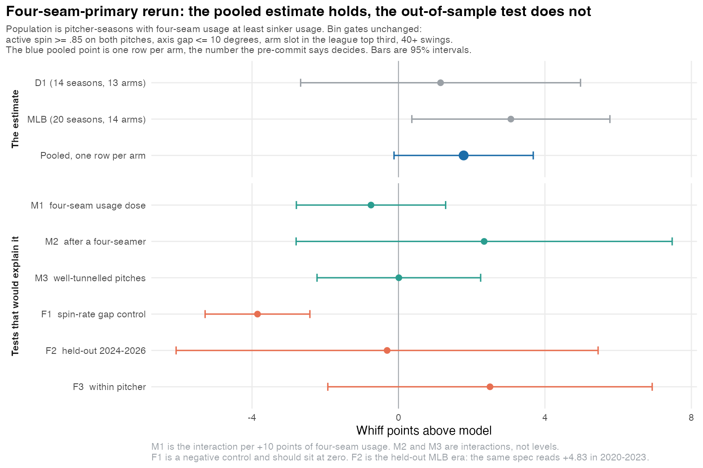

# Matched-axis changeups: decision memo

**Verdict: unexplained, and still not established.** The four-seam-primary rerun raised the
season-level pool and left the deciding (arm-clustered) number almost unchanged. Mechanisms are
still null. The held-out MLB era is now slightly negative. The splitter analog was too small to
test. Do not build on the bin yet. The decision rule for D1 2022/2026 is already locked in
[parachute_precommit.md](parachute_precommit.md).

**Useful is a different claim, and the RV decomposition does not support it.** The locked MLB
bin is −0.41 RV/100 versus the rest of the four-seam-primary pool (−0.29 vs +0.12). Replacing
balls in play with xwOBA-implied RV only closes that to −0.23. The extra miss versus the stuff
model is real as a residual and almost invisible as a raw rate (whiff share 17.0% vs 16.3%,
contribution +0.04 RV/100). The largest hole is contact: BIP RV/100 is −4.93 against −3.30,
xwOBA on contact 0.348 against 0.342. Neither gap is significant (p = 0.38 actual, 0.63 expected),
but the sign of expected contact is the wrong one for a luck story. Season-level actual RV
gap −0.54 (p = 0.30), expected −0.29 (p = 0.49).

Prevalence is the half that is already publishable as description, not as performance: **14 MLB
arms / 20 seasons (1.8% of the four-seam-primary changeup pool)** and **13 D1 arms / 14 seasons
(1.7%)**. Repeats: Kikuchi (3), Cease, Ray, Cabrera, Skubal (2 each).

The D1 axis transfer that was never run — inferred efficiency ≥ .95 on both pitches, axis cut at
the percentile matching MLB's ≤10° share of its own .95 pool (4.5% → 7.1°) — is +5.58 ± 3.77 on
5 arms (p = 0.14). Underpowered. MLB at the same .95 floor and a literal 10° cut is +0.55 on 12
seasons. That is the first D1 test where axis means approximately the same thing as Hawk-Eye, and
it does not establish the pitch.

## The specification

Gates unchanged from the original lock. The only new rule is a population filter, written down
before this rerun:

- changeup active spin >= .85 and four-seam active spin >= .85
- spin axis gap <= 10 degrees
- arm slot at or above the league's own 67th percentile, cut **after** the filter
- at least 40 changeup swings
- **four-seam usage >= sinker usage**; missing usage is dropped

The filter applies to the pool and the comparison group, not just the bin. Six of the old 27 MLB
bin seasons were sinker-primary. That exclusion was informed by the first look at MLB; it is locked
before new D1 seasons and is not a clean out-of-sample rule for this MLB rerun.

| | seasons | arms | effect | p |
|---|---|---|---|---|
| MLB 2020-2026 | 20 | 14 | +3.07 +/- 1.38 | 0.038 |
| D1 2023-2025 | 14 | 13 | +1.15 +/- 1.95 | 0.564 |
| Pooled, season-level | 34 | 27 | +2.43 +/- 1.12 | 0.031 |
| **Pooled, one row per arm (decides)** | **27** | **27** | **+1.78 +/- 0.97** | **0.067** |

Heterogeneity Q = 0.65 (p = 0.421). Permutation of the season-level pool: both leagues at or above
observed p = 0.0053; pooled p = 0.0205. The pre-commit says the arm-clustered number is the one
that decides, and that one is +1.78, p = 0.067.

Historical, before the filter: +1.82 +/- 0.98 on 42 seasons / 32 arms, p = 0.062. The filter
removed 601 sinker-primary seasons from the pool (MLB bin 27 → 20, D1 bin 15 → 14; D1 also lost
one to the recomputed arm percentile). The season-level estimate rose; the arm-clustered estimate
did not.

## What the effect is not

**Not the construction.** The spin-*rate* gap control, cut at the same 7 percent selectivity, is
now **-3.85 +/- 0.73** pooled (p < 0.001). A quality-confound story predicts that control comes
back positive. It is the opposite of positive.

**Not the 30-45 degree band.** On the filtered pool MLB 30-45 is +2.59 +/- 0.99 against 0-10 at
+3.28 +/- 1.38. Collapsed to one row per arm they are +1.79 vs +2.04. Best-of-five permutation for
30-45 is p = 0.196. D1 is −1.43 at 30-45. 0-10 is the only band that is positive in both leagues.

**Not release repeatability.** Bin vs out release scatter is 0.206 vs 0.212 in MLB and 0.307 vs
0.287 in D1. Controlling for scatter and the changeup-to-fastball slot gap moves the bin from
+2.03 to +2.10. Scatter still predicts on its own (−0.42 per SD, p = 0.003).

**Not batter handedness.** Flat in both leagues.

## Still not explained

**M1, four-seam usage dose.** Pooled interaction −0.075 per usage point (p = 0.47), or −0.75 per
+10 points. D1 is again significantly negative (−0.48, p = 0.007); MLB is +0.13 (p = 0.31). The
leagues still disagree.

**M2, prior-pitch DiD.** Pooled +2.34 +/- 2.62 (p = 0.37). Detectable at 80 percent power: 7.3
points. MLB +1.78, D1 +2.89. Weak null. Changeups after a four-seamer still underperform for
everyone (−1.72, p < 0.001).

**M3, tunnel interaction.** Pooled +0.01 +/- 1.14 (p = 0.99). The general tunneling slope is still
real: +0.47 whiff points per SD of better tunnel, p = 0.009, both leagues. It does not concentrate
in the bin.

## The test that still kills confidence

| era | seasons | arms | effect | p |
|---|---|---|---|---|
| 2020-2023, in sample | 12 | 9 | +4.83 +/- 1.64 | 0.003 |
| 2024-2026, held out | 6 | 6 | −0.31 +/- 2.94 | 0.917 |

The in-sample cell got larger after the filter. The held-out cell flipped sign. Six seasons cannot
rule out +1.8, but a collapse from +4.83 to −0.31 at the exact in-sample boundary is what a
threshold fitted to noise looks like. Within-pitcher, 12 MLB arms on both sides of the bin:
+2.50 +/- 2.26 (p = 0.29), Cease +18.5 to Jones −9.3.

## Splitter replication

Same gates, same four-seam-primary filter, FS instead of CH. Combined bin: **4 seasons from 4
MLB arms, 0 D1 seasons.** Under the pre-set gate of 10 this is underpowered, not a null. The four
MLB rows are mixed (+3.58, +1.07, +9.60, −17.20 on 40 swings). D1 had only 16 splitter
pitcher-seasons that cleared 40 swings, efficiency, and arm after the population filter; none
cleared the axis and slot gates together.

MLB FS coverage is 2023-2026 only (`parachute_rv.rds` has no splitters). Arm slot on the MLB FS
side is a release-point proxy, not Hawk-Eye.

## Multiplicity audit

Best-of-k permutation on the searches that produced published cells, using this filtered residual:

| family | MLB best | MLB p | D1 best | D1 p |
|---|---|---|---|---|
| axis bands (5) | 0-10, +3.07 | 0.125 | 0-10, +1.15 | 0.698 |
| arm x axis (6) | axis<=10 + top third, +3.07 | 0.011 | axis<=10 any slot, +2.08 | 0.208 |
| velo grid (18) | axis<=10 + top third + high velo, +5.08 | 0.082 | axis<=15 + top third + mid velo, +3.87 | 0.312 |
| locked cell, tested once | +3.07 | 0.015 | +1.15 | 0.274 |

The locked cell is MLB's best cell in the six-cell grid that selected it (p = 0.011 against that
family's null). It is not unusual as the best of five axis bands (p = 0.125), and D1's best cell
in the same six-cell family is a *different* one (axis<=10, any slot). That is the honest
multiplicity reading: MLB's locked cell survives its own small search and does not survive being
treated as the winner of the broader band search; D1 never had a cell that beats its own null.

## Findings that do not depend on the bin

These are from the same machinery and do not require the parachute cell to be real.

| finding | estimate | note |
|---|---|---|
| Better tunneling → more whiffs | +0.47 per SD, p = 0.009 | both leagues, pitch level, location already in the model |
| Tighter release scatter → more whiffs | −0.42 residual per SD of scatter, p = 0.003 | season level |
| Changeups after a four-seamer underperform | −1.72, p < 0.001 | everyone, not just the bin |
| Tight spin-*rate* matching underperforms | −3.85, p < 0.001 | the negative control |

Tunneling is the one I would act on. It is cross-league, pitch-level, and a mechanism.

## Verdict

The four-seam-primary filter did what a perception correction should do: it made the MLB
season-level number larger and left the D1 number in the same neighborhood. The number the
pre-commit says decides is still +1.78 +/- 0.97, p = 0.067 — the same verdict as +1.82. Nothing
attributes it to a hitter mistaking the pitch for a fastball. The only out-of-sample MLB look is
now negative. The splitter analog could not be run.

The honest statement is unchanged, with tighter language: two leagues still agree in sign on a
high-slot, high-efficiency, axis-matched changeup residual; the agreement is not a demonstrated
deception effect; the next data decides it under a rule that is already written down.

## What happens when D1 2022 and 2026 arrive

From [parachute_precommit.md](parachute_precommit.md), no rewriting:

- **confirm** if pooled p < 0.05 **and** the point estimate stays above +1.2
- **kill** if the point estimate falls below +0.8
- **unresolved** otherwise; wait for MLB 2027

Use the arm-clustered estimator as primary. Those two D1 seasons will overlap the 2023-2025
roster; extra seasons from the same arms are not independent.

## Reproduction

| script | produces |
|---|---|
| `baseball/spec_lock.R` | frozen bin, four-seam-primary filter, pooled + arm-clustered estimates |
| `baseball/mech_01_usage.R` | M1 |
| `baseball/mech_02_sequencing.R` | M2 |
| `baseball/mech_03_tunnel.R` | M3 |
| `baseball/mech_04_band.R` | 30-45 band diagnosis |
| `baseball/mech_05_falsify.R` | F1, F2, F3 |
| `baseball/mech_06_alt.R` | handedness, count, release consistency |
| `baseball/mech_07_figure.R` | the decision figure |
| `baseball/mech_08_splitter.R` | FS analog; gated at 4 seasons |
| `baseball/mech_09_multiplicity.R` | best-of-k permutation on the published searches |
| `baseball/mech_10_rv_decomp.R` | RV/100 by take / whiff / foul / BIP, plus xwOBA-implied BIP |
| `baseball/mech_11_d1_p95.R` | D1 .95 floor, axis percentile-matched to MLB's ≤10° share |

NCAA `PitcherId` is `integer64`. Load `bit64` before `as.character` or the IDs stringify to
garbage that joins to itself and not to the real digits.
