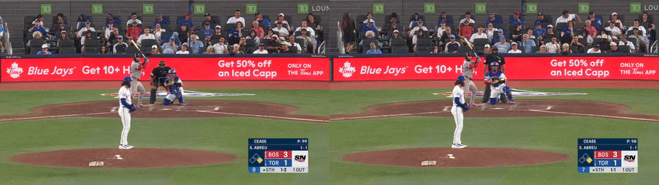
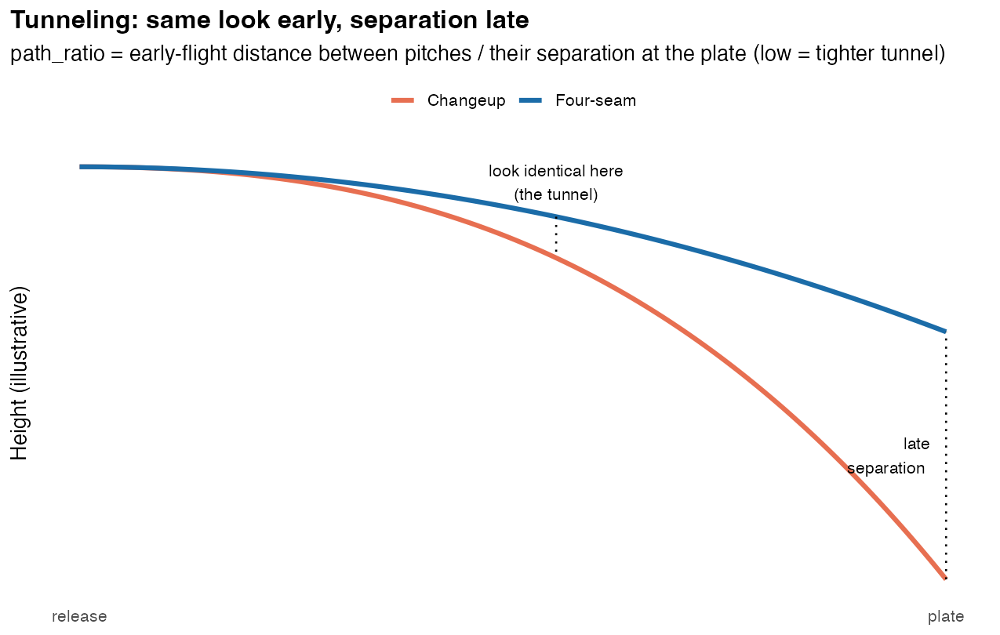
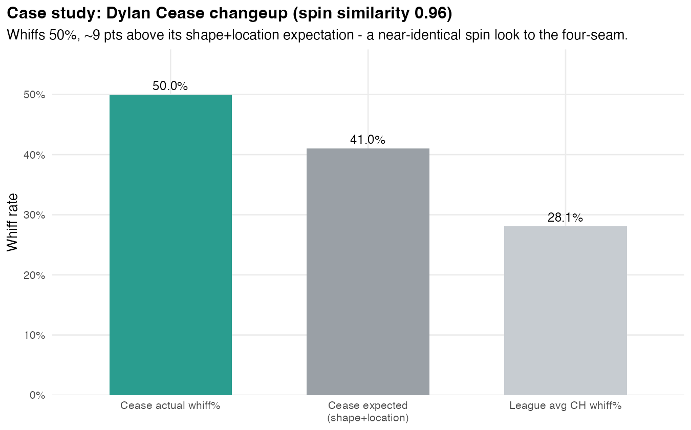

# The Parachute Changeup: The Case for Pair Deception

> **Status of record (do not skip this box).** The pre-registered, arm-clustered
> estimate for the locked matched-axis bin is **+1.78 ± 0.97 whiff points above
> a location-aware stuff model, p = 0.067**, MLB 2020–2026 pooled with D1
> 2023–2025. That is suggestive, not established. The bin is **negative on run
> value** (−0.41 RV/100). The confirmatory test is already written in
> [`parachute_precommit.md`](../data/statcast_model/article_assets/parachute_precommit.md)
> and waits on D1 TrackMan 2022 and 2026.
>
> This README is the **argument for the hypothesis**: why we think the effect is
> real, why the industry's tools are structurally blind to it, and what it looks
> like on video. It is written to persuade. Read
> [`parachute_decision_memo.md`](../data/statcast_model/article_assets/parachute_decision_memo.md)
> for the audit, and [`HANDOFF.md`](../HANDOFF.md)
> for how to reproduce every number here.

---

## The claim

A changeup that **spins on the same axis as the pitcher's four-seamer** gives
the hitter nothing to read out of the hand. Same release, same slot, same
spin picture. The only cue that separates it from the fastball is velocity, and
velocity is the one cue a hitter cannot resolve before the swing decision. So
the pitch gets fastball swings at a ball that arrives ten to fifteen mph late
and drops under the barrel. That is the whole mechanism. It is not a property of
the changeup. It is a property of the **pair**.

Every public stuff model (Stuff+, tjStuff+, PitchingBot, and every in-house
LightGBM clone including ours) grades a pitch as an **object**: velocity, spin,
movement, extension, release point. Handed a parachute changeup, the object
view sees a slow fastball with no shape of its own and grades it below the
league changeup. Then the pitch goes out and misses more bats than almost
anything in the study. The residual is the deception the model cannot see.

We are not the first people to believe this. We are just the first to have the
spin-axis data to check.

---

## What old-school coaches already knew

Before Hawk-Eye imaged spin axes, the changeup was taught almost entirely as a
*disguise*, not a *shape*:

- **"Fastball arm speed, fastball arm slot, fastball spin. Take ten off."**
  That sentence, or one like it, is in every pitching manual from the 1970s
  through the 2000s. Nobody said "give it a different clock face."
- **Jeremy Hellickson** was the modern textbook case. His changeup was mocked
  on movement plots as a fastball with the engine off, and it carried him to a
  Rookie of the Year season anyway. Scouts called it "invisible."

When movement plots and stuff models arrived, this knowledge was reclassified
as folklore, because it could not be measured and the shape metrics said the
pitch was bad. The pitch-design orthodoxy of the 2020s says: kill the spin
efficiency, pronate, buy arm-side run, get a "real" changeup. That orthodoxy
produced the **power changeup**, the only archetype in our study that
*underperforms* its stuff model (−1.96 whiff points, p = .0075). The old-school
disguise pitch is the one that beats it.

---

## Watch it

Statcast video is the fastest way to see the argument. Each link opens Baseball
Savant's search filtered to that pitcher's **changeup swinging strikes** for the
season, with a video icon on every row. The IDs below were resolved against the
MLB Stats API on 2026-09-09.

### Parachute exemplars (small axis gap, high slot, big velocity kill)

| Pitcher | Season | Axis gap vs FF | Arm slot | Velo sep | Whiff % | Model expected | Above model | Video |
|---|---|---|---|---|---|---|---|---|
| **Dylan Cease** | 2026 | 4.8° | 59.7° | 15.0 mph | 53.6% | 42.5% | **+11.0** | [CH whiffs](https://baseballsavant.mlb.com/statcast_search?hfPT=CH%7C&hfGT=R%7C&hfPR=swinging%5C.%5C.strike%7C&hfSea=2026%7C&player_type=pitcher&pitchers_lookup%5B%5D=656302&group_by=name&min_pitches=0&min_results=0&min_pas=0&sort_col=pitches&player_event_sort=api_p_release_speed&sort_order=desc#results) |
| **Tarik Skubal** | 2021 | 3.7° | 60.0° | 12.0 mph | 49.1% | 38.8% | **+10.3** | [CH whiffs](https://baseballsavant.mlb.com/statcast_search?hfPT=CH%7C&hfGT=R%7C&hfPR=swinging%5C.%5C.strike%7C&hfSea=2021%7C&player_type=pitcher&pitchers_lookup%5B%5D=669373&group_by=name&min_pitches=0&min_results=0&min_pas=0&sort_col=pitches&player_event_sort=api_p_release_speed&sort_order=desc#results) |
| **Andrew Abbott** | 2023 | 9.8° | 45.0° | 6.2 mph | 39.4% | 28.7% | **+10.7** | [CH whiffs](https://baseballsavant.mlb.com/statcast_search?hfPT=CH%7C&hfGT=R%7C&hfPR=swinging%5C.%5C.strike%7C&hfSea=2023%7C&player_type=pitcher&pitchers_lookup%5B%5D=671096&group_by=name&min_pitches=0&min_results=0&min_pas=0&sort_col=pitches&player_event_sort=api_p_release_speed&sort_order=desc#results) |
| **Robbie Ray** | 2025 | 6.1° | 43.6° | 8.6 mph | 39.2% | 33.1% | **+6.1** | [CH whiffs](https://baseballsavant.mlb.com/statcast_search?hfPT=CH%7C&hfGT=R%7C&hfPR=swinging%5C.%5C.strike%7C&hfSea=2025%7C&player_type=pitcher&pitchers_lookup%5B%5D=592662&group_by=name&min_pitches=0&min_results=0&min_pas=0&sort_col=pitches&player_event_sort=api_p_release_speed&sort_order=desc#results) |
| **Yusei Kikuchi** | 2025 | 6.7° | 39.1° | 9.0 mph | 25.1% | 25.0% | +0.1 | [CH whiffs](https://baseballsavant.mlb.com/statcast_search?hfPT=CH%7C&hfGT=R%7C&hfPR=swinging%5C.%5C.strike%7C&hfSea=2025%7C&player_type=pitcher&pitchers_lookup%5B%5D=579328&group_by=name&min_pitches=0&min_results=0&min_pas=0&sort_col=pitches&player_event_sort=api_p_release_speed&sort_order=desc#results) |

Residuals are `r4`: out-of-fold whiff residual over tjStuff+ v3.0 features plus
arm angle plus location, from
`Rscript baseball/bin_roster_detail.R searched`. Kikuchi is included on
purpose. He is the most frequent member of the locked bin (three seasons) and
he does **not** beat the model. Matched spin alone is not enough. Matched spin
**plus a large velocity kill** is the engine (see below).

**Cease, 2026-08-11 at Toronto, same at-bat vs. Abreu.** Left is pitch 99, a
97.5 mph four-seamer. Right is pitch 98, the changeup one pitch earlier at
77.7 mph, swinging strike. Velo difference and spin similarity drive the
performance of this pitch that a stuff+ model would not be able to pick up.



### Old-school reference clips

| Pitcher | Season | Note | Video |
|---|---|---|---|
| **Jeremy Hellickson** | 2016 | Pre-2020, so no Hawk-Eye active spin; not in any bin. Included as the pitch the industry used to call "invisible." | [CH whiffs](https://baseballsavant.mlb.com/statcast_search?hfPT=CH%7C&hfGT=R%7C&hfPR=swinging%5C.%5C.strike%7C&hfSea=2016%7C&player_type=pitcher&pitchers_lookup%5B%5D=476451&group_by=name&min_pitches=0&min_results=0&min_pas=0&sort_col=pitches&player_event_sort=api_p_release_speed&sort_order=desc#results) |
| **Cole Ragans** | 2024 | Branded as a parachute early. Often **fails** the ≤ 10° axis gate in the data. Do not treat branding as membership. | [CH whiffs](https://baseballsavant.mlb.com/statcast_search?hfPT=CH%7C&hfGT=R%7C&hfPR=swinging%5C.%5C.strike%7C&hfSea=2024%7C&player_type=pitcher&pitchers_lookup%5B%5D=666142&group_by=name&min_pitches=0&min_results=0&min_pas=0&sort_col=pitches&player_event_sort=api_p_release_speed&sort_order=desc#results) |

### Make your own GIFs and side-by-sides

`baseball/parachute_clips.py` pulls the highest-leverage changeup whiffs for a
pitcher-season straight from Savant, downloads the broadcast clip, and writes a
GIF. With `--pair` it also grabs a four-seam swinging strike from the same game
and stacks the two clips side by side so the release frames can be compared.

```bash
.venv-cv/bin/python baseball/parachute_clips.py --pitcher 656302 --season 2026 --n 3 --pair
```

Output lands in `data/statcast_model/article_assets/clips/`. Clips are
ordered by velocity separation from the season-mean four-seamer, largest
first, so the top of the list is where the mechanism is most visible. Requires
`data/rubber/play_ids_<season>.csv` (from `baseball/rubber_01_playids.py`) and
`requests` and `imageio-ffmpeg` (both in `.venv-cv`). Only 2025 and 2026
playId tables exist today; Skubal 2021 needs
`rubber_01_playids.py --season 2021` first (a full-season harvest, ~2.6 MB per
game). Savant's clip endpoints are unofficial and may change.

> Rob Friedman's Pitching Ninja overlays are the canonical visual for this idea.
> Search his feed for "Cease changeup overlay" or "Skubal changeup fastball
> overlay." We do not redistribute those; the script above builds an unofficial
> equivalent from the public clips.

---

## What the numbers say

### 1. The archetype the industry likes least beats its model most

From the Aug 25 article draft (75-swing floor, four-seam-primary, strict
temporal holdout: train 2020–2023, score 2024–2026). **These cuts are not the
locked spec**, but they are the clearest picture of the pattern:

| Archetype | Seasons | Predicted whiff | Actual whiff | Miss |
|---|---|---|---|---|
| Extreme seam shift | 10 | 30.1% | 43.1% | **+13.0** |
| Tight axis match | 17 | 30.3% | 41.3% | **+11.0** |
| Seam-shifted match | 44 | 29.2% | 37.3% | +8.1 |
| Axis + separation | 56 | 29.9% | 36.2% | +6.3 |
| Traditional, low seam dev | 26 | 30.8% | 34.1% | +3.3 |
| Power changeup | 66 | 30.1% | 29.2% | −0.9 |

Sort the league by how badly a pitch designer would want to "fix" the changeup,
and you have sorted it by how badly the model underestimates it. The ordering
is inverted against the orthodoxy almost perfectly.

### 2. It repeats

If the residual were noise, arms would not keep it. Year-over-year correlation
of the whiff residual: **r = .577** (n = 40, p = .0001) for the
axis-plus-separation group; **r = .453** (n = 31, p = .01) for the seam-shifted
group. Arms who beat their model do it again the next year.

### 3. Handing the model the features does not fix it

We added spin-axis gap, seam deviation, arm slot, arm-angle gap, season-mean
arsenal summaries, interaction products, and finally an explicit archetype flag
frozen on the training years. Share of each archetype's gap that all of that
closed:

| Archetype | Gap, stuff only | Gap, everything | Closed |
|---|---|---|---|
| Traditional, low seam dev | 3.76 | 0.73 | 81% |
| Axis + separation | 6.98 | 3.51 | 50% |
| Tight axis match | 10.73 | 6.38 | 41% |
| Seam-shifted match | 9.93 | 6.81 | 31% |
| Extreme seam shift | 16.28 | 12.41 | 24% |

The stronger the effect, the less of it any feature set recovers. That is not
a missing column. It is a missing **frame**: the model scores one pitch, and
the deception lives in the relationship between two.

A related trap from Aug 3–6: putting `axis_diff` into a gated all-types model
made things *worse*. The model learned "bigger spin difference → more miss"
(splitters and kick-changes) and buried Cease and Vesia together. The right
proof is a residual over a model that **never sees the axis gap**, then asking
whether matched-axis pitches sit above zero.

### 4. Matched spin alone is worthless; matched spin plus a kill is the pitch

The first thing the 2026 discovery work found, and the thing every later cut
confirms: same axis with a small velocity gap **underperforms**. Same axis with
a 10+ mph kill overperforms. Kikuchi (9 mph, +0.1) versus Cease (15 mph,
+11.0) is the whole story in two rows. The fastball look buys the swing; the
kill makes the swing miss.

### 5. The gradient has been consistent even when the cliff has not

Across every residual definition, every anchor choice, and both leagues, the
*direction* is the same: tighter axis gap and higher slot → more residual whiff.
The 4-D gate search on Aug 11 (6,084 combinations) only ever reached for arm
and axis, discarding the active-spin gates, and it landed Cease 2026 and Skubal
2021 on top of the bin (`fig37_optimal_gates.png`). What the search could
**not** do is locate a threshold that survives a permutation null. That is a
sample-size statement, not a direction statement.

---

## Why the stuff model cannot see it

A stuff model asks: *given this pitch's velocity, spin, movement, release, how
often does a swing miss?* Every feature is a fact about the ball in isolation.

A hitter asks a different question: *is this the pitch I have already decided
I'm seeing?* For the first fifteen feet, a matched-axis changeup answers "yes."
The information that would say "no" (velocity, and if present seam-shifted
wake) does not resolve until the swing is committed.

The power changeup fails for the mirror-image reason. Its 28.6° axis gap and
7.9° arm-angle gap announce it. The hitter gets shape and release information
early, and the model's good grade is measuring exactly the features that give
it away.

This is why "add axis_diff as a feature" cannot work and why 24–41% closure is
the ceiling. The model needs the **hitter's expectation** as an input, and the
hitter's expectation is set by a different pitch.



*Two pitches share a flight path early and separate late. A matched-axis
changeup shares the spin picture as well as the path.*



*Cease's changeup: spin similarity 0.96 to his four-seamer, 50% whiff against a
shape-plus-location expectation near 41% and a league changeup rate of 28%.*

---

## Where the naive version breaks, and the refinement we believe

The purest tight-axis pitch misses bats and **still loses runs**: whiff channel
+0.37 RV/100, ball-in-play channel −0.90. A backspinning ball thrown slowly from
a high slot is a fly ball when it is squared. Deception without depth gets you
whiffs and homers in the same season.

The article draft's proposed fix, generated **after** the lock and therefore
exploratory (`baseball/velo_sep_45_sep_vs_seam.R`,
`velo_sep_46_axis_matched_drop.R`):

| Cell | Seasons | Whiff residual | RV / 100 |
|---|---|---|---|
| Axis match **+ seam-shifted wake** | 44 | **+4.00** (p < .0001) | **+0.38** |
| Axis match, no seam shift | 26 | +0.88 (p = .44) | +0.12 |
| Extreme seam shift | 10 | **+7.80** (p < .0001) | **+0.82** |

The matched axis buys the swing. Seam-shifted wake, movement the spin does not
predict and the hitter cannot see, buys the miss and protects the contact. If
this survives a pre-registered test it reconciles the whiff finding with the
run-value finding. Until then it lives in `06_exploratory/`.

---

## Reproducing the numbers here

| Number | Script | Output |
|---|---|---|
| Exemplar table (Cease +11.0, Skubal +10.3, Abbott +10.7) | `Rscript baseball/bin_roster_detail.R searched` | `article_assets/ext_bin_roster_searched.csv` |
| Locked bin +1.78 / p = .067 | `Rscript baseball/spec_lock.R` | `data/statcast_model/locked_spec.rds` |
| Mechanism battery | `baseball/mech_01_usage.R` … `mech_11_d1_p95.R` | `parachute_decision_memo.md` |
| Archetype inversion / feature closure / seam-shift cells | `baseball/velo_sep_45_*.R`, `velo_sep_46_*.R` | `parachute_article.md` (draft, not confirmatory) |
| Gate search + permutation | `Rscript baseball/optimal_gates.R` | `fig37_optimal_gates.png` |
| Clips and GIFs | `.venv-cv/bin/python baseball/parachute_clips.py` | `article_assets/clips/` |

Rules that cannot be relaxed while doing any of this: four-seam anchor only, no
sinker fallback; arm-aware residual (`r4`) for anything gated on arm; `bit64`
before touching NCAA `PitcherId`; `spec_lock.R` is the only bin definition for
confirmatory claims; `rv = -delta_run_exp`, positive favours the pitcher. The
full list is in the handoff, §0 and §13.
